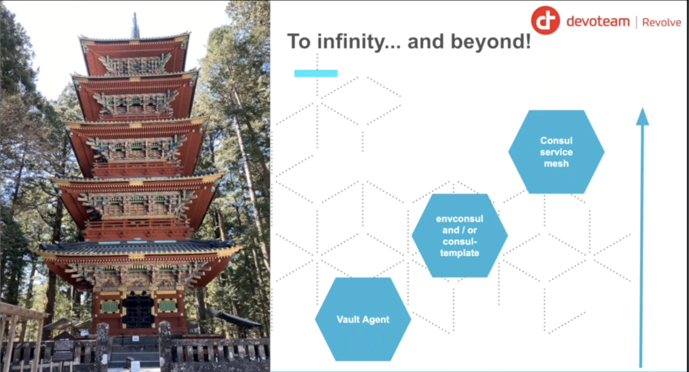
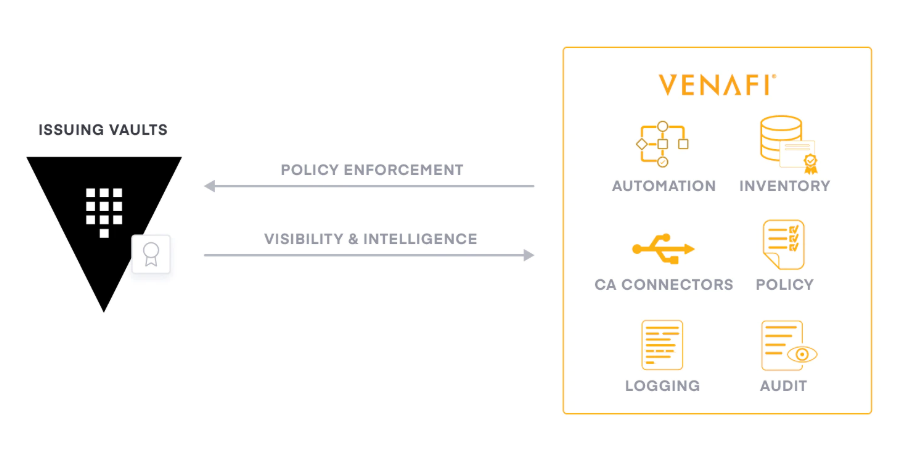

# Vault Training (using Spring Boot Application)


This repository is dedicated to the talk: **Be secret like a ninja with Vault Hashicorp** (Spring Boot Edition).

**Disclaimer**: The repository is here for demonstration purpose. Meaning: No best practice and a lot of review.

For the demonstration, we will based on a basic application using the following stack:

* Spring Boot (Java)
* PostgreSQL
* HashiCorp Vault

### Prerequisites

Before starting the steps, make sure you have the following tools installed:

* Docker
* Docker Compose
* Terraform
* Java
* Maven
* Git 
* Scripting (shell)
* Curl (or any http client)

## Introduction 

### What is Vault ?

Vault is a tool for secrets management, encryption, and authentication. It is a tool that helps you to manage your secrets in a secure way.


### Vault Architecture :

The following diagram shows the Vault architecture, it's a simple diagram to understand the Vault architecture (it's a production architecture used to deploy Vault in production). 


The key Benefits of Deploying Vault in Multi-AZ is :

- High Availability (HA) — No Single Point of Failure
- Strong Resilience Against Infrastructure Failures
- Secure and Consistent Data with HA Backends
- Zero-Downtime Upgrades & Maintenance
- Better Security Posture (Defense in Depth)
- Improved Performance & Latency (Smart Placement)
- Mandatory for Production & Compliance
- Disaster Recovery & Backup Readiness

### Vault Storage Backend : 

Vault supports multiple storage backends, including : 

- Consul
- DynamoDB
- Filesystem
- GCS
- In-memory
- Integrated Storage (Raft)
- PostgreSQL
- Redis
- S3
- SQL Server
- Zookeeper


**Note**: 
- In this demo, we will use the `Integrated Storage (Raft)` backend.
- In production, we will use the `High Availability (HA)` backend with any backend storage.
- In dev, we will use the `In-memory` backend (not recommended for production).


### Integration in CI/CD pipeline (OPS side)?

CI/CD pipeline is a process that automates the entire software delivery process. It includes the following steps to deploy an infrastructure (Infrastructure as Code - IaC):

* Create Infrastructure as Code (IaC) using Terraform 
* Push IaC to Gitlab repository (or any other repository)
* Deploy Infrastructure using Terraform : in this step, we will use : 
  - Create the Database (for example, PostgreSQL)
  - Create the `Vault secrets` for access to the database : in this step, we will use `Database` secrets engine (to generate **dynamic credentials**) or simply we can create a `KV` secrets engine (to generate **static credentials**)
  - Create the `Vault policies` : in this step, we will create the policies to control the access to the secrets using **Vault policies** 
  - Create the authentication method `AppRole`: in this step, we will create the `AppRole` authentication method and attach the policies to it in order to control the access to the secrets (for example, we can create a policy to allow the application to read the secrets). We can also use other authentication methods like `Kubernetes` authentication method, `AWS` authentication method, `Azure` authentication method, etc. 

The following diagram shows the CI/CD pipeline:


### How to use to integrate Vault in our IaC pipeline?

To integrate Vault with your Infrastructure as Code (IaC) pipeline, we typically use the **AppRole** authentication method. This method is specifically designed for machine-to-machine communication, allowing your automated pipelines or applications to securely authenticate with Vault.

In order to use AppRole, we need to enable the AppRole authentication method in Vault and create a role for our application (each role has its own RoleID and SecretID). After that, we can use the RoleID and SecretID to authenticate with Vault and get a Vault token in order to access the secrets. 

The following diagram shows the AppRole authentication method:


To avoid the security risk of the SecretID, we can communicate only the `RoleID` to developers team. After that, the `SecretID` will be generated by the CI/CD pipeline. 

 After that the IaC use the `RoleID` and `SecretID` to authenticate with Vault and get a Vault token in order to access the secrets. 
 
 The following diagram shows the AppRole authentication method:


```text
Terraform → Vault (via OIDC / token / K8s auth)
Terraform → creates SecretID for AppRole
Terraform → logs in using RoleID + SecretID
Terraform → create/reads secrets
Terraform → create policies
Terraform → create auth method
```

#### Integration Workflow

The integration follows a structured process involving both the infrastructure provisioning and the application deployment pipeline:

1.  **Admin Setup (Terraform)**:
    - **Enable AppRole Auth Method**: Enable the `approle` backend in Vault.
    - **Define Policies**: Create Vault policies that define specific permissions (e.g., `read` access to `kv/data/my-app/*`).
    - **Create AppRole**: Define a role (e.g., `my-app-role`) and attach the policies to it.
    - **Generate RoleID**: This is a static identifier for the role.

2.  **CI/CD Pipeline Execution**:
    - The pipeline uses a high-privilege Vault token (or its own AppRole) to generate a **SecretID** for the target application's role.
    - The pipeline receives both the **RoleID** and **SecretID**.
    - These IDs are then passed to the application (via environment variables, Kubernetes secrets, or configuration files).

3.  **Application Authentication**:
    - At runtime, the application sends the `RoleID` and `SecretID` to Vault's `/v1/auth/approle/login` endpoint.
    - Vault validates the IDs and returns a short-lived **Vault Token**.
    - The application uses this token to fetch its required secrets.

#### Example: Provisioning AppRole with Terraform

```hcl
# 1. Enable AppRole
resource "vault_auth_backend" "approle" {
  type = "approle"
}

# 2. Create a Role
resource "vault_approle_auth_backend_role" "my_app" {
  backend        = vault_auth_backend.approle.path
  role_name      = "my-app-role"
  token_policies = ["default", "my-app-policy"]
  token_ttl      = "1h"
  token_max_ttl  = "24h"
}

# 3. Read RoleID
data "vault_approle_auth_backend_role_id" "my_app_id" {
  backend   = vault_auth_backend.approle.path
  role_name = vault_approle_auth_backend_role.my_app.role_name
}

output "role_id" {
  value = data.vault_approle_auth_backend_role_id.my_app_id.role_id
}
```

#### Example: Retrieving SecretID in CI Pipeline (Bash/GitLab CI)

```bash
# Get SecretID for the role
export VAULT_SECRET_ID=$(vault write -f -field=secret_id auth/approle/role/my-app-role/secret-id)

# Pass RoleID and SecretID to the deployment
# env:
#   VAULT_ROLE_ID: ${VAULT_ROLE_ID}
#   VAULT_SECRET_ID: ${VAULT_SECRET_ID}
```


## Steps ? Which steps ?

To better understand the integration process, we have split the execution into several steps.


### Step 0: Find secrets

In this step, we start the necessary infrastructure (Vault and PostgreSQL) using Docker Compose. Also we start the Web application (Spring Boot) using Docker Compose.

In this step, we will use the `In-memory` backend for Vault (not recommended for production). Also, the main goal is to find the secrets in the application code (database credentials, api keys, SSL certificates, etc.) and put them in Vault in a static way (static secrets) in the next step.


In addition, we will explore the Vault basics:

- Authentication Methods
- Secrets
- Policies

See more details on the [step0/vault-basics/README.md](./step0/vault-basics/README.md).

See more details on the [step0/README.md](./step0/README.md).

### Step 1: Static Secrets

In this step, we add a entrypoint dealing with Vault (Authentication + retrieve secrets) inside the application without changing the code.

To integrate Vault in our application, we need to follow the following steps:

* Create Vault (any method you want)
* Find Secret in application code (database credentials, api keys, SSL certificates, etc.)
* Put secrets in Vault (static)
* Configure **Authentication Method** (AppRole, Kubernetes, AWS, Azure, etc.)
* Configure **Vault Policies**
* Refactor application to use **Vault secrets**
* Run Application

See more on the [step1/README.md](./step1/README.md).

### Step 2: Dynamic Secrets (Secret as a Service)

In this step, we remove the entrypoint in the previous step and changing the applications code.
To integrate Vault in our application, we need to follow the following steps:

* Create Vault (any method you want)
* Find Secret in application code (database credentials, api keys, SSL certificates, etc.)
* Put secrets in Vault (dynamic)
* Configure **Authentication Method** (AppRole, Kubernetes, AWS, Azure, etc.)
* Configure **Vault Policies**
* Refactor application to use **Vault secrets**
* Run Application

The goal is to use, at each time, a new database user (username+password) access.


See more on the [step2/README.md](./step2/README.md).

### Step 3: Encryption as a Service

In this step, based on the previous step, we will add encryption and decryption process.

The goal is to encrypt the data into the database.

See more on the [step3/README.md](./step3/README.md).


### Step 4: PKI as a Service 

In this step, based on the previous step, we will add PKI (Public Key Infrastructure) as a service.

The goal is to generate certificates and private keys on the fly.

See more on the [step4/README.md](./step4/README.md).

### Step 5: Vault agent only 

In this step, based on the step 3, we will use Vault agent to authentication with Vault server and to render template file with secrets. It's an alternative to the step 6. The step 6 is a way to implement secret through environment variables and step 6 is a way to implement secret through a file.

The goal is to interact with the Vault transparently for an application (no app change).

See more on the [step5/README.md](./step5/README.md).

### Step 6: Vault agent & Consul Env & Consul Template

In this step, based on the previous step, we will use Vault agent to authentication with Vault server and Consul Env to populate secrets into environment variables.

The goal is to interact with the Vault transparently for an application (no app change).

See more on the [step6/README.md](./step6/README.md).



### Step 7: Venafi & Vault (SSL/TLS)

In this step, based on the previous step, we will use Venafi to generate certificates and private keys on the fly.

The goal is to generate certificates and private keys on the fly.

See more on the [step7/README.md](./step7/README.md).




### Step 8: Vault Agent (initContainer & Sidecar Pattern, CSI provider)

In this step, based on the previous step, we will use Vault agent to authentication and get secrets from Vault server.

The goal is to interact with the Vault transparently for an application (no app change).

We can use the following patterns:
- initContainer
- Sidecar Pattern
- CSI provider

See more on the [step8/README.md](./step8/README.md).


### Step 9: Cert-Manager with Vault PKI

In this step, based on the previous step, we will use Cert-Manager to generate certificates and private keys on the fly.

The goal is to generate certificates and private keys on the fly.

See more on the [step9/README.md](./step9/README.md).


## Contact

You see something wrong ? You want extra information or more ?

Contact me: <dagboujhatem@gmail.com>

## References
- [Youtube Video](https://www.youtube.com/watch?v=RjlZlrm06Qw&list=PLCFwfUlM-doMLAAH5gAc-eOaC-Csi4JvX)
- [Github Inspiration](https://github.com/mehdilaruelle/vault-demo/tree/master)
- [Vault Agent Injector Tutorial (initContainer)](https://devopscube.com/vault-agent-injector-tutorial/)
- [Medium article on how to use Vault CSI driver](https://apavankumar.medium.com/hashicvault-secrets-in-kubernetes-with-csi-driver-ec917d4a2672)
- [Vault CSI driver on Kubernetes](https://piotrminkowski.com/2023/03/20/vault-with-secrets-store-csi-driver-on-kubernetes/)
- [Kubernetes Vault integration via Sidecar Agent Injector vs. Vault Secrets Operator vs. CSI provider](https://www.hashicorp.com/en/blog/kubernetes-vault-integration-via-sidecar-agent-injector-vs-csi-provider)
- [Medium article on how to use PKI as a Service](https://medium.com/hashicorp-engineering/pki-as-a-service-with-hashicorp-vault-a8d075ece9a)
- [Medium article : Setting Up PKI Engine with HashiCorp Vault for Certificate Management](https://manjit28.medium.com/setting-up-pki-engine-with-hashicorp-vault-for-certificate-management-ca35f10c9600)
- [Medium article on how to use Cert-Manager](https://medium.com/@tashikmoinsheikh/the-ultimate-deep-dive-automating-ssl-tls-with-cert-manager-in-kubernetes-83c91ae11df4)
- [Medium article on how to use Cert-Manager using HELM](https://medium.com/@selvamraju007/cert-manger-use-case-how-to-deploy-cert-manager-and-how-to-configure-it-to-get-certificates-for-8da2a7e2396)
- [Medium article on how to use Cert-Manager / Vault Integration with Local CA](https://rob-mengert.medium.com/cert-manager-vault-integration-with-local-ca-1ae52fb442c2)
- [Medium article on how to use HashiCorp Vault as Certificate Issuer on a Kubernetes Cluster](https://genekuo.medium.com/using-hashicorp-vault-as-certificate-manager-on-a-kubernetes-cluster-155604d39a60)


