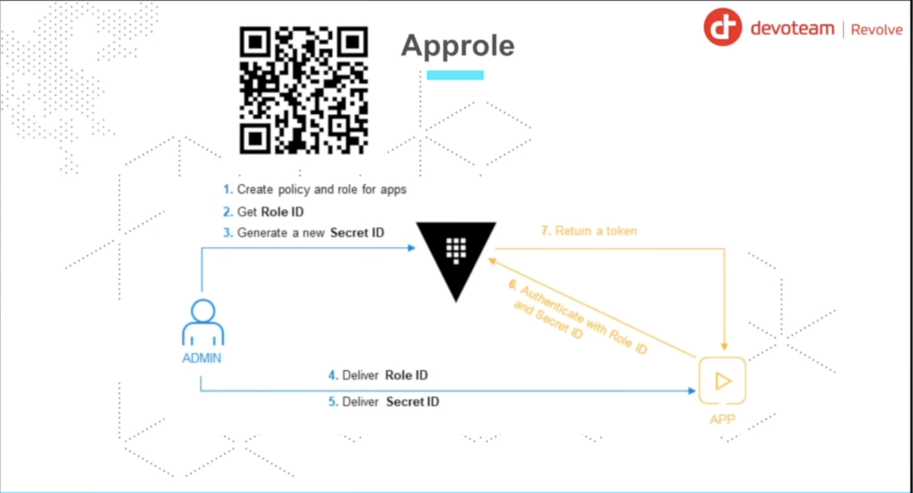
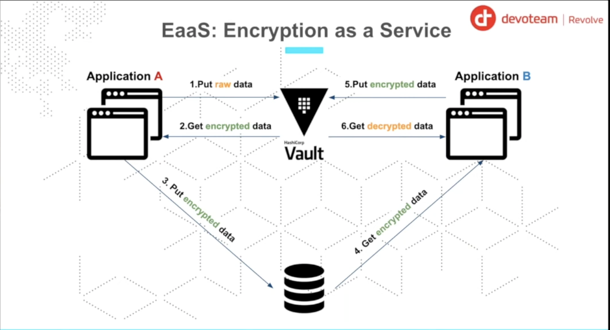

# Vault Training (using Spring Boot Application)

This repository is dedicated to the talk: **Be secret like a ninja with Vault Hashicorp** (Spring Boot Edition).

**Disclaimer**: The repository is here for demonstration purpose. Meaning: No best practice and a lot of review.

For the demonstration, we will based on a basic application using the following stack:

* Spring Boot (Java)
* PostgreSQL
* HashiCorp Vault

### Prerequisites

Before starting the steps, make sure you have the following tools installed:

* Docker
* Docker Compose
* Terraform
* Java
* Maven
* Git 
* Scripting (shell)
* Curl (or any http client)

## Introduction 

### What is Vault ?

Vault is a tool for secrets management, encryption, and authentication. It is a tool that helps you to manage your secrets in a secure way.

### Vault Architecture :

The following diagram shows the Vault architecture, it's a simple diagram to understand the Vault architecture (it's a production architecture used to deploy Vault in production). 

The key Benefits of Deploying Vault in Multi-AZ is :

- High Availability (HA) — No Single Point of Failure
- Strong Resilience Against Infrastructure Failures
- Secure and Consistent Data with HA Backends
- Zero-Downtime Upgrades & Maintenance
- Better Security Posture (Defense in Depth)
- Improved Performance & Latency (Smart Placement)
- Mandatory for Production & Compliance
- Disaster Recovery & Backup Readiness

### Vault Storage Backend : 

Vault supports multiple storage backends, including : 

- Consul
- DynamoDB
- Filesystem
- GCS
- In-memory
- Integrated Storage (Raft)
- PostgreSQL
- Redis
- S3
- SQL Server
- Zookeeper

**Note**: 
- In this demo, we will use the `Integrated Storage (Raft)` backend.
- In production, we will use the `High Availability (HA)` backend with any backend storage.
- In dev, we will use the `In-memory` backend (not recommended for production).

### Integration in CI/CD pipeline (OPS side)?

CI/CD pipeline is a process that automates the entire software delivery process. It includes the following steps to deploy an infrastructure (Infrastructure as Code - IaC):

* Create Infrastructure as Code (IaC) using Terraform 
* Push IaC to Gitlab repository (or any other repository)
* Deploy Infrastructure using Terraform : in this step, we will use : 
  - Create the Database (for example, PostgreSQL)
  - Create the `Vault secrets` for access to the database : in this step, we will use `Database` secrets engine (to generate **dynamic credentials**) or simply we can create a `KV` secrets engine (to generate **static credentials**)
  - Create the `Vault policies` : in this step, we will create the policies to control the access to the secrets using **Vault policies** 
  - Create the authentication method `AppRole`: in this step, we will create the `AppRole` authentication method and attach the policies to it in order to control the access to the secrets (for example, we can create a policy to allow the application to read the secrets). We can also use other authentication methods like `Kubernetes` authentication method, `AWS` authentication method, `Azure` authentication method, etc. 

The following diagram shows the CI/CD pipeline:

### How to use to integrate Vault in our IaC pipeline?

## Steps ? Which steps ?

To better understand the integration process, we have split the execution into several steps.

To integrate Vault in your application, you need to follow the following steps:

* Create Vault (any method you want)
* Find Secret in application code (database credentials, api keys, SSL certificates, etc.)
* Put secrets in Vault (static or dynamic)
* Configure **Authentication Method** (AppRole, Kubernetes, AWS, Azure, etc.)
* Configure **Vault Policies**
* Refactor application to use **Vault secrets**
* Run Application

### Step 0: Find secrets

In this step, we start the necessary infrastructure (Vault and PostgreSQL) using Docker Compose.

See more details on the [step0/README.md](./step0/README.md).

In this step, we will explore the Vault basics:

- Authentication Methods
- Secrets
- Policies

See more details on the [step0/vault-basics/README.md](./step0/vault-basics/README.md).

### Step 1: Static Secrets

In this step, we add a entrypoint dealing with Vault (Authentication + retrieve secrets) inside the application without changing the code.

See more on the [step1/README.md](./step1/README.md).

### Step 2: Dynamic Secrets (Secret as a Service)

In this step, we remove the entrypoint in the previous step and changing the applications code.

The goal is to use, at each time, a new database user (username+password) access.

See more on the [step2/README.md](./step2/README.md).

### Step 3: Encryption as a Service

In this step, based on the previous step, we will add encryption and decryption process.

The goal is to encrypt the data into the database.

See more on the [step3/README.md](./step3/README.md).

### Step 4: PKI as a Service 

In this step, based on the previous step, we will add PKI (Public Key Infrastructure) as a service.

The goal is to generate certificates and private keys on the fly.

See more on the [step4/README.md](./step4/README.md).

### Step 5: Vault agent only 

In this step, based on the step 3, we will use Vault agent to authentication with Vault server and to render template file with secrets. It's an alternative to the step 4. The step 4 is a way to implement secret through environment variables and step 4b is a way to implement secret through a file.

The goal is to interact with the Vault transparently for an application (no app change).

See more on the [step5/README.md](./step5/README.md).

### Step 6: Vault agent & Consul Env & Consul Template

In this step, based on the previous step, we will use Vault agent to authentication with Vault server and Consul Env to populate secrets into environment variables.

The goal is to interact with the Vault transparently for an application (no app change).

See more on the [step6/README.md](./step6/README.md).

## Contact

You see something wrong ? You want extra information or more ?

Contact me: <dagboujhatem@gmail.com>

## References
- [Youtube Video](https://www.youtube.com/watch?v=RjlZlrm06Qw&list=PLCFwfUlM-doMLAAH5gAc-eOaC-Csi4JvX)
- [Github Inspiration](https://github.com/mehdilaruelle/vault-demo/tree/master)
