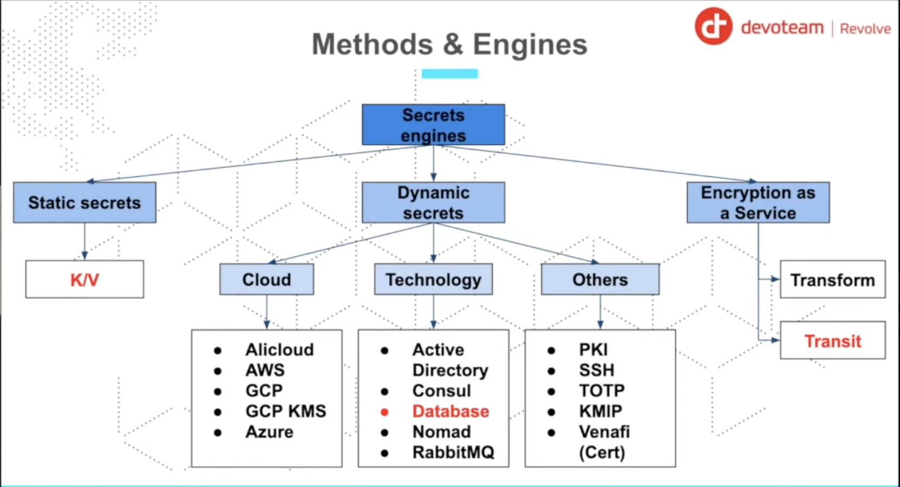
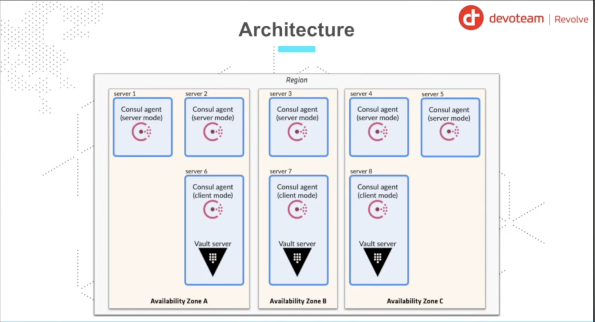
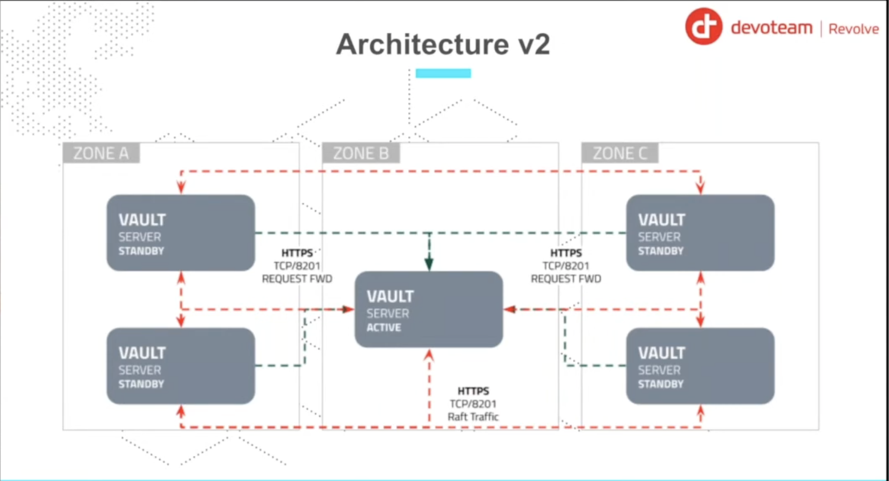
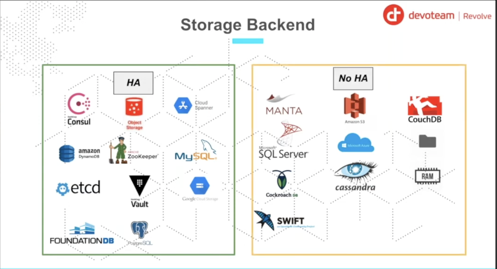
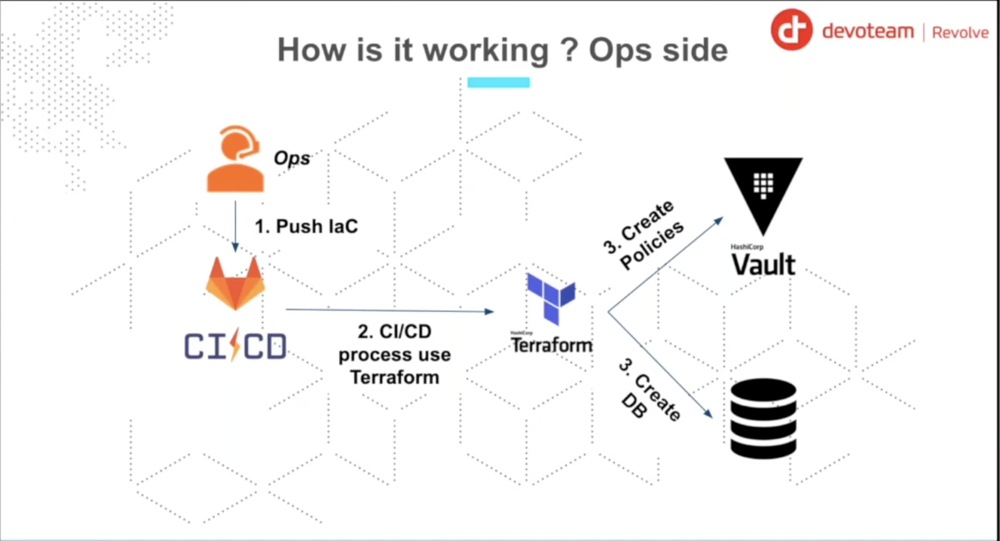
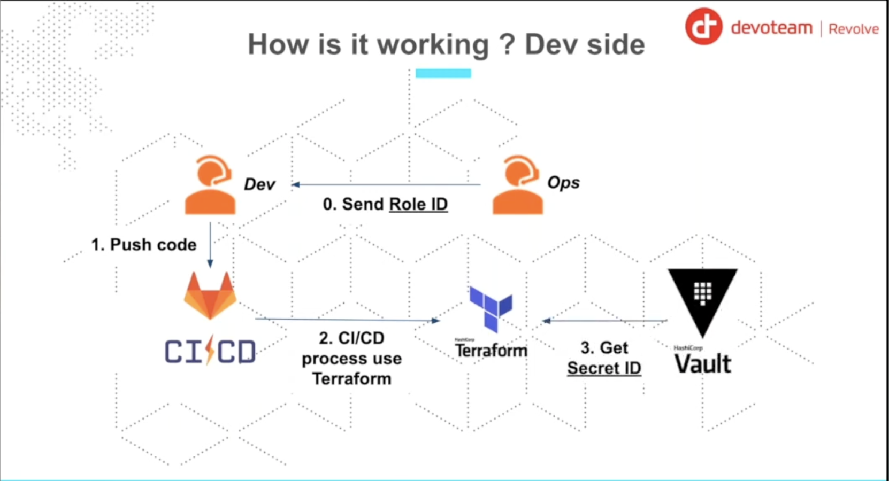
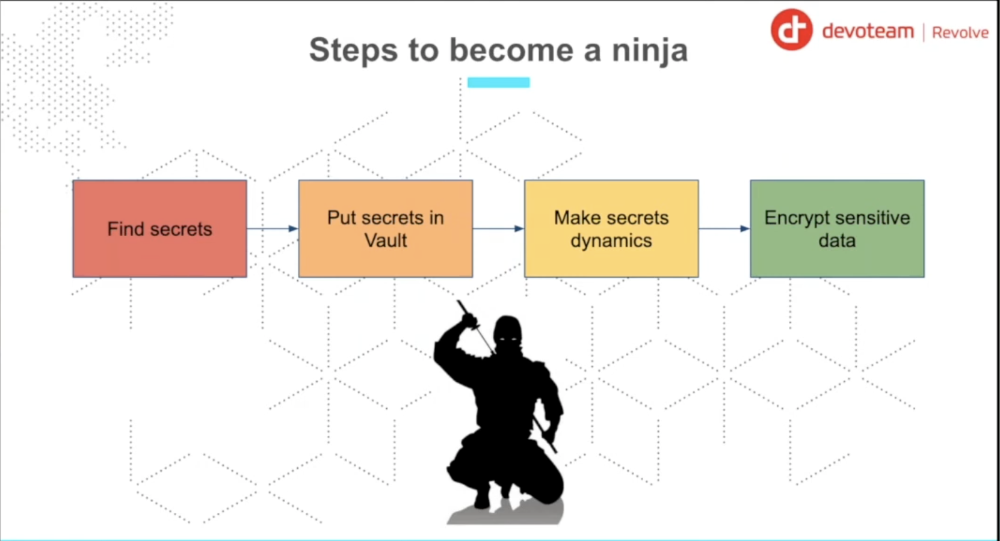

# Vault Training (using Spring Boot Application)

This repository is dedicated to the talk: **Be secret like a ninja with Vault Hashicorp** (Spring Boot Edition).

**Disclaimer**: The repository is here for demonstration purpose. Meaning: No best practice and a lot of review.

For the demonstration, we will based on a basic application using the following stack:

* Spring Boot (Java)
* PostgreSQL
* HashiCorp Vault

### Prerequisites

Before starting the steps, make sure you have the following tools installed:

* Docker
* Docker Compose
* Terraform
* Java
* Maven
* Git 
* Scripting (shell)
* Curl (or any http client)

## Introduction 

### What is Vault ?

Vault is a tool for secrets management, encryption, and authentication. It is a tool that helps you to manage your secrets in a secure way.

### Vault Architecture :

The following diagram shows the Vault architecture, it's a simple diagram to understand the Vault architecture (it's a production architecture used to deploy Vault in production). 

The key Benefits of Deploying Vault in Multi-AZ is :

- High Availability (HA) — No Single Point of Failure
- Strong Resilience Against Infrastructure Failures
- Secure and Consistent Data with HA Backends
- Zero-Downtime Upgrades & Maintenance
- Better Security Posture (Defense in Depth)
- Improved Performance & Latency (Smart Placement)
- Mandatory for Production & Compliance
- Disaster Recovery & Backup Readiness

### Vault Storage Backend : 

Vault supports multiple storage backends, including : 

- Consul
- DynamoDB
- Filesystem
- GCS
- In-memory
- Integrated Storage (Raft)
- PostgreSQL
- Redis
- S3
- SQL Server
- Zookeeper

**Note**: 
- In this demo, we will use the `Integrated Storage (Raft)` backend.
- In production, we will use the `High Availability (HA)` backend with any backend storage.
- In dev, we will use the `In-memory` backend (not recommended for production).

### Integration in CI/CD pipeline (OPS side)?

CI/CD pipeline is a process that automates the entire software delivery process. It includes the following steps to deploy an infrastructure (Infrastructure as Code - IaC):

* Create Infrastructure as Code (IaC) using Terraform 
* Push IaC to Gitlab repository (or any other repository)
* Deploy Infrastructure using Terraform : in this step, we will use : 
  - Create the Database (for example, PostgreSQL)
  - Create the `Vault secrets` for access to the database : in this step, we will use `Database` secrets engine (to generate **dynamic credentials**) or simply we can create a `KV` secrets engine (to generate **static credentials**)
  - Create the `Vault policies` : in this step, we will create the policies to control the access to the secrets using **Vault policies** 
  - Create the authentication method `AppRole`: in this step, we will create the `AppRole` authentication method and attach the policies to it in order to control the access to the secrets (for example, we can create a policy to allow the application to read the secrets). We can also use other authentication methods like `Kubernetes` authentication method, `AWS` authentication method, `Azure` authentication method, etc. 

The following diagram shows the CI/CD pipeline:

### How to use to integrate Vault in your Application (DEV side)?

To integrate Vault in your application, you need to follow the following steps:

* Configure Vault
* Extract Credentials
* Run Application

## Steps ? Which steps ?

To better understand the integration process, we have split the execution into several steps.

### Step 0: Infrastructure

In this step, we start the necessary infrastructure (Vault and PostgreSQL) using Docker Compose.

See more on the [step0/run.sh](./step0/run.sh).

### Step 1: Configuration (Terraform)

In this step, we use Terraform to configure Vault. This includes enabling the AppRole authentication method, creating policies, and setting up the database secret engine.

See more on the [step1/run.sh](./step1/run.sh).

### Step 2: Extract Credentials

In this step, we retrieve the `RoleID` and `SecretID` generated by Terraform. These are the "keys" our application needs to login to Vault.

See more on the [step2/run.sh](./step2/run.sh).

### Step 3: Verification

In this step, we simply verify that we have successfully retrieved the credentials before trying to use them.

See more on the [step3/run.sh](./step3/run.sh).

### Step 4: Run Application (AppRole)

In this final step, we run the Spring Boot application. It uses the credentials from Step 2 to authenticate with Vault, fetch the database credentials, and connect to PostgreSQL.

See more on the [step4/run.sh](./step4/run.sh).

### Step 4b (bonus): Coming Soon

Future step for alternative authentication methods or advanced usage (e.g., Vault Agent).

## Contact

You see something wrong ? You want extra information or more ?

Contact me: <dagboujhatem@gmail.com>

## References
- [Youtube Video](https://www.youtube.com/watch?v=RjlZlrm06Qw&list=PLCFwfUlM-doMLAAH5gAc-eOaC-Csi4JvX)
- [Github Inspiration](https://github.com/mehdilaruelle/vault-demo/tree/master)
