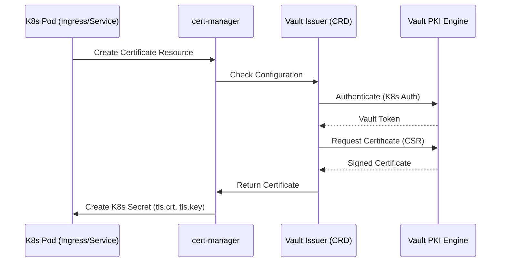
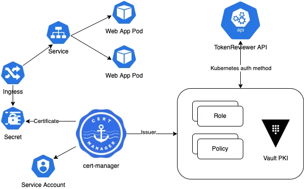

# Cert-Manager with Vault PKI

**cert-manager** is a popular Kubernetes operator that automates the management, issuance, and renewal of TLS certificates. Integrating it with **Vault PKI** combines Kubernetes-native certificate management with Vault's centralized security and auditing.

## How it Works

Cert-manager acts as a bridge between your Kubernetes applications and the Vault PKI secrets engine.

## Key Kubernetes Resources

### 1. Issuer / ClusterIssuer
The `Issuer` (namespace-scoped) or `ClusterIssuer` (cluster-scoped) defines how cert-manager should connect to Vault.

### 2. Certificate
The `Certificate` resource defines the desired state of a certificate (DNS names, secret name, issuer reference). Cert-manager monitors this resource and ensures the corresponding Kubernetes `Secret` is created and renewed before expiration.

## Why use cert-manager with Vault?

-   **Automated Lifecycle**: Certificates are automatically renewed based on their TTL, preventing outages due to expired certs.
-   **K8s Native Experience**: Developers use standard Kubernetes manifests to request certificates.
-   **Centralized Control**: Even though certificates are used in Kubernetes, the Root/Intermediate CAs and all issuance policies remain centrally managed in Vault.
-   **Short-lived Certs at Scale**: Easily manage thousands of short-lived certificates across multiple clusters.

## Best Practices

-   **AppRole or K8s Auth**: Use the Kubernetes Auth Method for the Issuer to authenticate with Vault.
-   **Scoped Policies**: The Vault policy used by cert-manager should only have `update` permissions on the `pki/sign/<role>` path.
-   **Separate Issuers**: Use different `Issuers` for different environments (dev, prod) or different subdomains.
-   **Monitor Renewal**: Use cert-manager's events and Prometheus metrics to monitor for issuance or renewal failures.

## References
- [cert-manager Vault Issuer Documentation](https://cert-manager.io/docs/configuration/vault/)
- [Vault PKI Secrets Engine](https://developer.hashicorp.com/vault/docs/secrets/pki)
- [Medium article on how to use Cert-Manager](https://medium.com/@tashikmoinsheikh/the-ultimate-deep-dive-automating-ssl-tls-with-cert-manager-in-kubernetes-83c91ae11df4)
- [Medium article on how to use Cert-Manager using HELM](https://medium.com/@selvamraju007/cert-manger-use-case-how-to-deploy-cert-manager-and-how-to-configure-it-to-get-certificates-for-8da2a7e2396)
- [Medium article on how to use Cert-Manager / Vault Integration with Local CA](https://rob-mengert.medium.com/cert-manager-vault-integration-with-local-ca-1ae52fb442c2)
- [Medium article on how to use HashiCorp Vault as Certificate Issuer on a Kubernetes Cluster](https://genekuo.medium.com/using-hashicorp-vault-as-certificate-manager-on-a-kubernetes-cluster-155604d39a60)
