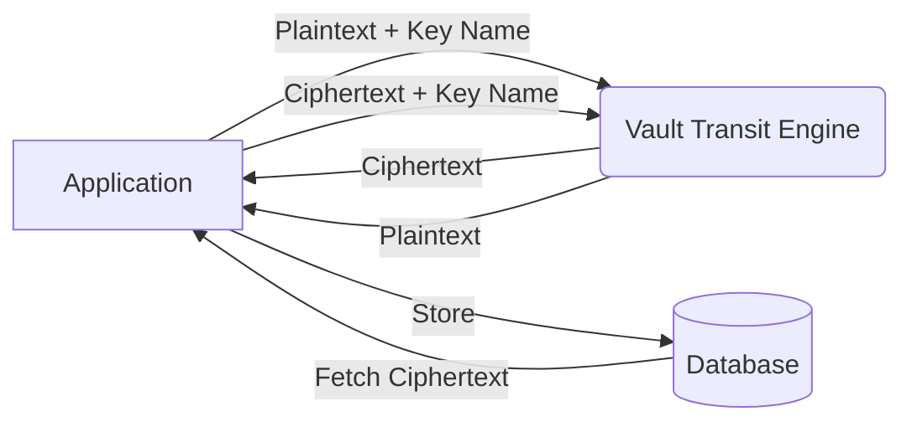

# Encryption as a Service (Transit)

The **Transit Secrets Engine** in Vault provides "encryption as a service". Unlike other engines that store data, Transit is used to process data in transit—performing cryptographic functions like encryption, decryption, and signing without storing the data itself.

## Why use Transit?

1.  **Simplify Key Management**: Applications don't need to manage their own encryption keys or deal with complex libraries (like OpenSSL or Bouncy Castle).
2.  **Offload Cryptography**: The burden of protecting sensitive data (like PII) is offloaded to Vault's centralized, secure, and audited environment.
3.  **Key Rotation**: Transit allows for seamless key rotation. You can rotate the underlying key and still decrypt data encrypted with previous versions (ciphertext is versioned).
4.  **Consolidated Audit**: Every encryption or decryption request is logged in Vault's audit trails, providing a clear record of who accessed what data.

## Common Workflows

### 1. Encryption
The application sends plaintext data to Vault. Vault encrypts it using a named key and returns the ciphertext (prefixed with `vault:v1:...`).

### 2. Decryption
The application sends the ciphertext back to Vault. If the requester has the appropriate policy permissions, Vault returns the original plaintext.

### 3. Rewrapping
If a key is rotated, you can "rewrap" old ciphertext. Vault will decrypt it using the old version and re-encrypt it using the new version without the application ever seeing the plaintext.

## Best Practices

-   **Fine-grained Policies**: Ensure applications only have `encrypt` or `decrypt` capabilities on the specific keys they need.
-   **Convergent Encryption**: Use this if you need the same plaintext to produce the same ciphertext (useful for database indexing).
-   **Data-in-Transit only**: Never use Transit for long-term storage of large volumes of data (like files); it's optimized for smaller strings like social security numbers, credit card info, or configuration values.

## References
- [Vault Transit Secrets Engine](https://developer.hashicorp.com/vault/docs/secrets/transit)
