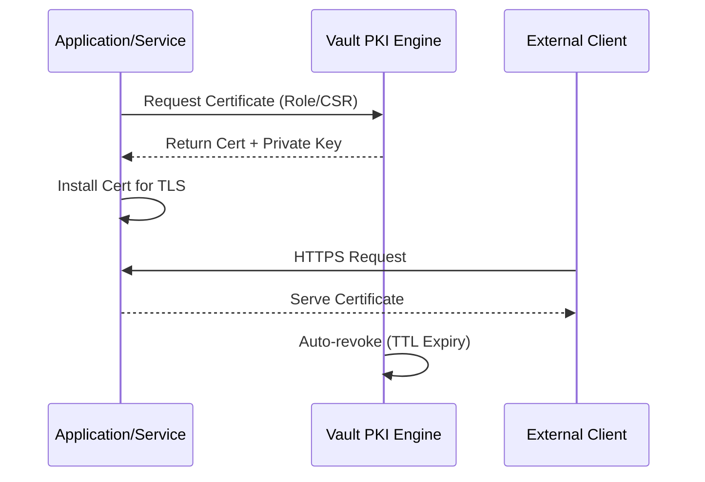

# PKI as a Service

The **PKI (Public Key Infrastructure) Secrets Engine** in Vault allows you to generate X.509 certificates and private keys on the fly. This turns Vault into a dynamic Certificate Authority (CA).

## Why PKI as a Service?

Traditional PKI management is slow and manual. Vault's PKI engine provides:
1.  **Automation**: Certificates can be requested and issued in milliseconds via API.
2.  **Short-lived Certificates**: Instead of 1-2 year certificates, you can issue certificates that last only hours or days, significantly reducing the blast radius of a compromised key.
3.  **Revocation**: Vault maintains a CRL (Certificate Revocation List) and supports OCSP.
4.  **Security**: The Root and Intermediate CA private keys are protected within Vault's secure storage.

## The Certificate Lifecycle

## Key Concepts

-   **Role**: A set of rules that define the certificate's properties (TTL, allowed domains, key type).
-   **Root CA**: The highest level of trust. Often kept offline or in a highly secure environment.
-   **Intermediate CA**: Signed by the Root CA. Vault typically acts as an Intermediate CA for daily certificate issuance.
-   **Dynamic Issuance**: Certificates are generated on-demand and are not stored in Vault's persistent storage by default to keep the storage clean (unlike KV secrets).

## Benefits of Short-lived Certs

-   **No need for Revocation Monitoring**: If a certificate expires in 1 hour, the incentive to monitor CRLs is lower because the window for abuse is extremely small.
-   **Zero Manual Toil**: Developers don't need to manually create CSRs or wait for security team approval.

## Best Practices

-   **Use Intermediaries**: Always use Intermediate CAs for issuing certificates to avoid exposing your Root CA.
-   **Monitor TTLs**: Ensure your applications are capable of reloading certificates without downtime when they are renewed.
-   **External CRL**: Use an external location (like GCS or S3) to host your CRL so clients can access it even if Vault is under high load.

## References
- [Vault PKI Secrets Engine](https://developer.hashicorp.com/vault/docs/secrets/pki)
