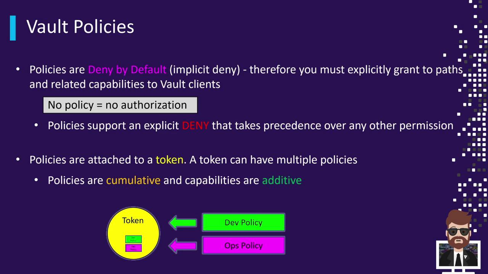

# Vault Policies

Policies in Vault control what a user or application can access. Everything in Vault is path-based, and policies define the permissions (capabilities) allowed on those paths.



##  Polices vs Capabilities

A Vault policy is:

- A named set of rules
- Written in HCL
- Attached to a token / AppRole / AWS role /  Kubernetes SA

Example:

```hcl 
vault_policy "myapp-prod"
```


```hcl
path "secret/data/webapp/*" {
  capabilities = ["read", "list"] 
}
```
## Policy Syntax (HCL)

Vault policies are written in HashiCorp Configuration Language (HCL). A policy consists of one or more path blocks.

```hcl
# Allow reading secrets from the "webapp" path
path "secret/data/webapp/*" {
  capabilities = ["read", "list"]
}

# Allow full control over the "dev" path
path "secret/data/dev/*" {
  capabilities = ["create", "read", "update", "delete", "list"]
}

# Explicitly deny access to the "admin" path
path "secret/data/admin/*" {
  capabilities = ["deny"]
}
```

## All Capabilities in Vault:

-   **read**: Allows reading the data at the path.
-   **create**: Allows creating data at the path.
-   **update**: Allows updating data at the path.
-   **delete**: Allows deleting the data at the path.
-   **list**: Allows listing the keys at the path.
-   **sudo**: Allows access to paths that are otherwise restricted to root users (e.g., system configuration).
-   **deny**: Explicitly disallows all access.

## How Policies are Attached

1.  **Creation**: An administrator creates a policy using the CLI, UI, or API.
2.  **Assignment**: The policy is linked to an authentication method, a group, or a specific entity.
3.  **Token Generation**: When a user logs in, Vault looks up the associated policies and embeds them into the issued token.
4.  **Enforcement**: For every request, Vault checks if the token has the necessary capabilities for the requested path.

## The Default Policy

Vault has a `default` policy that provides basic functionality, such as allowing a token to look up information about itself and change its own password (if using `userpass`). This policy is usually attached to all tokens unless explicitly excluded.


## Bests Practices

- Use **least privilege**: Only grant the permissions necessary for the application to function.
- Use **path-based policies**: Use specific paths instead of wildcards.
- Use **deny rules**: Use deny rules to explicitly deny access to sensitive paths.
- Use **token TTL**: Set an appropriate TTL for tokens to minimize the window of opportunity for abuse.
- Use **policy groups**: Use policy groups to manage policies for multiple applications.

## References

- [Vault Policies](https://developer.hashicorp.com/vault/docs/concepts/policies)  