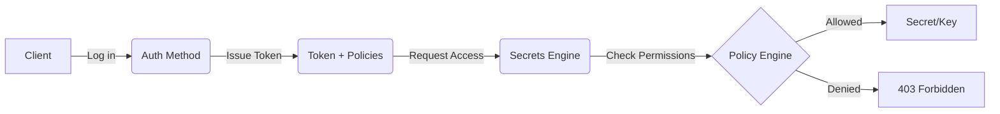

# Vault Basics

This directory contains documentation on the fundamental concepts of HashiCorp Vault. Understanding these three pillars is essential for managing secrets and access control effectively.

## Core Concepts

Vault's security model is built on three main components that work together to secure your infrastructure:

1.  **[Secrets Engines](./Secrets.md)**: How Vault stores, generates, and manages sensitive data (static and dynamic).
2.  **[Policies](./Policies.md)**: How Vault defines and enforces what an authenticated identity is allowed to do.
3.  **[Authentication Methods](./Auth-methods.md)**: How users and applications prove their identity to Vault.

## How they interact

The typical workflow in Vault follows these steps:

1.  A client authenticates via an **Auth Method**.
2.  Vault validates the identity and issues a **Token** with specific **Policies** attached.
3.  The client uses the Token to access a **Secrets Engine**.
4.  Vault's **Policy Engine** verifies if the Token has the required capabilities for the requested path.
5.  If authorized, Vault provides the secret or dynamic credential.

---

## References

For more detailed information, please refer to the individual documentation files linked above.

- [Vault Authentication Methods](https://developer.hashicorp.com/vault/docs/auth)
- [Vault Policies](https://developer.hashicorp.com/vault/docs/concepts/policy)
- [Vault Secrets Engines](https://developer.hashicorp.com/vault/docs/secrets)
