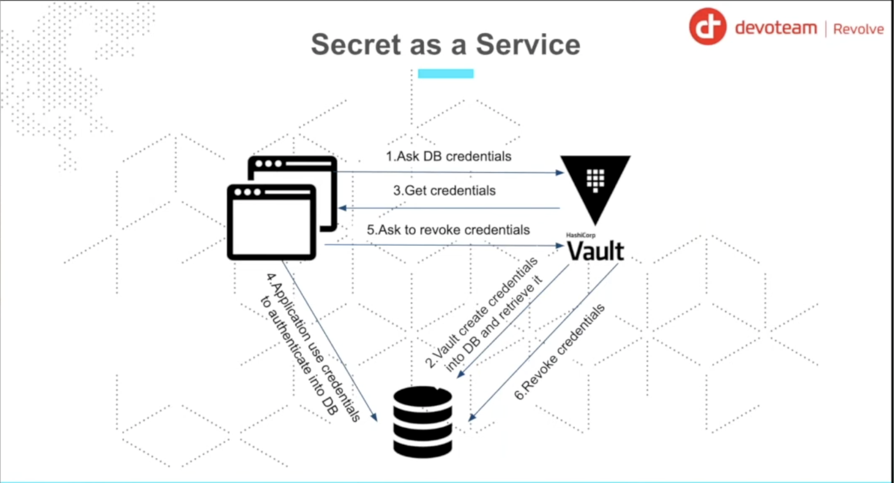

# Vault Secrets Engines

Secrets engines are components within Vault that store, generate, or encrypt data. They are flexible and can handle static secrets, dynamic secrets, or encryption services.

## Static Secrets: Key-Value (KV)

The KV secrets engine is used to store arbitrary secrets within the configured physical storage for Vault.

-   **Version 1**: Simple key-value storage.
-   **Version 2**: Supports versioning of secrets, allowing you to roll back to previous versions or recover deleted secrets.

Example path: `secret/data/webapp/config`

### Secret v1 vs Secret v2

KV (Key-Value) secrets engine comes in two versions:

| Feature | KV Version 1 | KV Version 2 |
| :--- | :--- | :--- |
| **Versioning** | No versioning (overwrite only) | Supports multiple versions (up to a limit) |
| **Deletion** | Permanent deletion | Soft delete (can be undeleted) |
| **Check-and-Set (CAS)** | Not supported | Supported (prevents accidental overwrites) |
| **Path Structure** | Direct path (e.g., `secret/myapp`) | Injects `data/` or `metadata/` (e.g., `secret/data/myapp`) |
| **Metadata** | No metadata support | Supports custom metadata and per-version data |
| **API Complexity** | Simple | More complex (due to versioning) |

**Important:** KV (v1 or v2) is only for static secrets, not dynamic credentials.

## Dynamic Secrets (Best Practices)

Dynamic secrets are generated on-demand and have a limited lifetime. This is one of Vault's most powerful features.

-   **Database**: Vault can generate temporary credentials for databases (SQL, NoSQL). When an application needs to connect, it asks Vault for credentials, and Vault creates a new user with specific permissions.
-   **Cloud**: Generate temporary IAM access keys or tokens for AWS, GCP, and Azure.
-   **PKI**: Generate X.509 certificates on the fly.

### Benefits of Dynamic Secrets
-   **No Shared Credentials**: Every client gets unique credentials.
-   **Automatic Revocation**: Credentials automatically expire (lease expires) or can be revoked immediately if a breach is detected.
-   **Auditability**: Every generated secret is tied to a specific lease and can be tracked.

## Secret Lifecycle

1.  **Lease**: Every secret returned by Vault has a lease associated with it.
2.  **TTL (Time-To-Live)**: The duration for which the secret is valid.
3.  **Renewal**: Some leases can be renewed before they expire to extend their lifetime.
4.  **Revocation**: Once a lease expires (or is explicitly revoked), Vault will automatically delete the credential from the target system (e.g., dropping the database user).

### Static Secret vs Dynamic Secret

| Feature | Static Secrets (KV) | Dynamic Secrets |
| :--- | :--- | :--- |
| **Generation** | Manually stored or CI/CD managed | Generated on-demand by Vault |
| **Lifetime** | Persist until manually changed/deleted | Short-lived (attached to a lease) |
| **Credentials** | Shared among authorized clients | Unique for every single request |
| **Revocation** | Manual process | Automatic upon lease expiry |
| **Target System** | Vault itself stores the data | Target system (DB, Cloud) creates the identity |

### Use Cases for each type of secrets (Static vs Dynamic)

#### Static Secrets (KV)
-   Storing **API Keys** for 3rd party services (SendGrid, Twilio, etc.).
-   **Application Configuration** that is sensitive (license keys).
-   **Certificates** that are not yet managed by a PKI (legacy certs).
-   **Master Passwords** that are rarely rotated.

#### Dynamic Secrets
-   **Database Access**: Temporary users for SQL/NoSQL databases to avoid hardcoded credentials.
-   **Cloud Infrastructure**: Temporary IAM roles for AWS, GCP, or Azure.
-   **PKI**: On-the-fly generation of TLS certificates for internal services.
-   **SSH**: Temporary OTP or signed keys for server access.

## Bests Practices

- Use **KV v2** for static secrets (configuration values, API keys, fixed credentials).
- Use **Dynamic Secrets Engines** (Database, AWS, PKI, etc.) for dynamic secrets
(ephemeral credentials with TTL and automatic rotation).
- Use **Token authentication only for manual or temporary usage** (testing, troubleshooting, break-glass access).
- Use **Userpass authentication only for simple, non-production environments** (local demos, labs, PoCs).
- Prefer **machine-based authentication methods** in production: 
    - **AppRole** for CI/CD, VMs, legacy apps.
    - **Kubernetes authentication** for containerized workloads (Pods, StatefulSets, Deployments).
    - **JWT** for external services (e.g., API gateways).
    - **Userpass** for human operators (e.g., DBAs, DevOps engineers).
    - **Token** for temporary or break-glass access.
    - **AWS auth** for EC2, ECS, Lambda
    - **OIDC** for Humans (SSO)

## References

- [Vault Secrets Engines](https://developer.hashicorp.com/vault/docs/secrets)
- [Vault Secrets Version](https://developer.hashicorp.com/vault/docs/secrets/kv)
