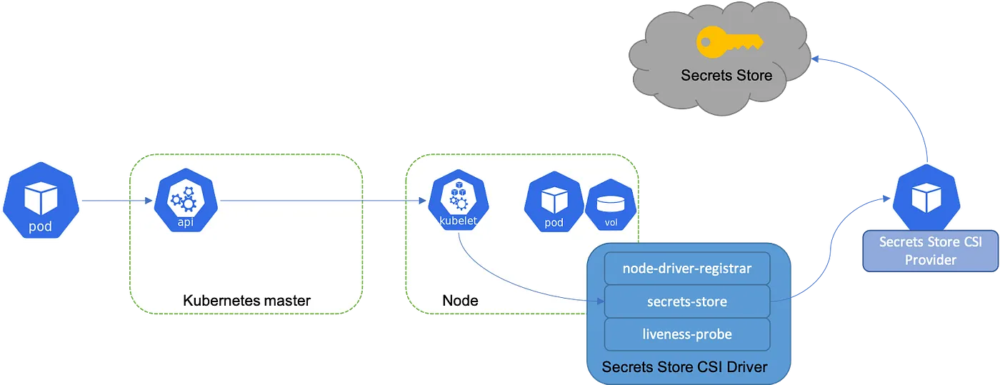

# Vault Agent

**Vault Agent** is a client-side daemon that provides a set of features to simplify the adoption of Vault by applications. It handles authentication, token lifecycle management, and secret caching/templating.

## Deployment Modes

In Kubernetes, Vault Agent is typically deployed in one of two ways:

### 1. InitContainer
The agent runs as a temporary container before the main application container starts.
- **Use Case**: When the application only needs secrets at startup (static configuration).
- **Pros**: Zero overhead during application runtime.
- **Cons**: Cannot renew secrets or handle dynamic rotation while the app is running.

### 2. Sidecar
The agent runs alongside the main application container throughout its entire lifecycle.
- **Use Case**: When the application needs to handle dynamic secrets rotation or periodic updates.
- **Pros**: Transparent secret renewal and template re-rendering without restarting the app.
- **Cons**: Consumes resources (CPU/RAM) while the Pod is running.

## Vault CSI Provider (Alternative)

The **Secrets Store CSI Driver** (Container Storage Interface) allows Kubernetes to mount secrets stored in Vault as a volume.
- **How it works**: The CSI driver communicates with Vault to fetch secrets and mounts them as a `tmpfs` volume accessible to the Pod.
- **Key Features**: 
    - Secrets are never stored on the disk of the node.
    - Can sync Vault secrets to Kubernetes `Secret` objects.
- **Comparison**: Use CSI for simple volume mounts; use Vault Agent for complex templating or high-performance caching.

## Best Practices for Performance

To ensure optimal performance and reliability when using Vault Agent:

1.  **Use Caching**: Enable the Vault Agent **Cache** to reduce the load on the Vault server and decrease latency for repeated secret lookups.
2.  **Resources Requests/Limits**: Set appropriate CPU and Memory requests for your sidecars to prevent OOM kills or CPU throttling.
3.  **Graceful Shutdown**: Ensure your application can handle the agent shutting down. Use `preStop` hooks if necessary to signal cleanup.
4.  **Template Optimization**: Keep templates simple. Complex Logic in HCL templates can increase processing time.
5.  **Audit Scaling**: Monitor the number of agents connecting to Vault. If you have thousands of Pods, ensure your Vault server is scaled to handle the authentication thundering herd.
6.  **Use Shared Memory**: Mount the secrets directory as a `memory` volume (`emptyDir: { medium: Memory }`) to ensure secrets are never written to persistent storage.

## References
- [Vault Agent Overview](https://developer.hashicorp.com/vault/docs/agent)
- [Vault Secret Store CSI Driver](https://developer.hashicorp.com/vault/docs/platform/k8s/csi)
- [Medium article on how to use Vault CSI driver](https://apavankumar.medium.com/hashicvault-secrets-in-kubernetes-with-csi-driver-ec917d4a2672)
-  [Vault Agent Injector Tutorial (initContainer)](https://devopscube.com/vault-agent-injector-tutorial/)
- [Vault CSI driver on Kubernetes](https://piotrminkowski.com/2023/03/20/vault-with-secrets-store-csi-driver-on-kubernetes/)
- [Kubernetes Vault integration via Sidecar Agent Injector vs. Vault Secrets Operator vs. CSI provider](https://www.hashicorp.com/en/blog/kubernetes-vault-integration-via-sidecar-agent-injector-vs-csi-provider)

