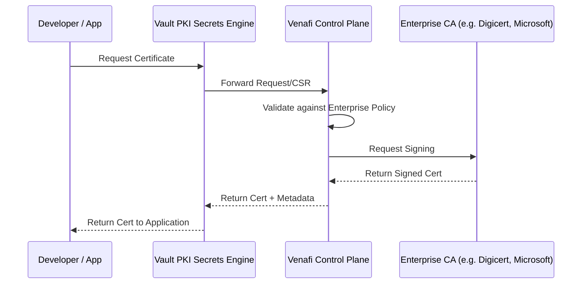

# HashiCorp Vault and Venafi Integration

The integration between **HashiCorp Vault** and **Venafi** allows organizations to combine Vault's agility and developer-friendly API with Venafi's enterprise-grade machine identity management and policy enforcement.

## How it Works

Vault can act as a local certificate authority (CA) while delegating the actual certificate issuance, policy validation, and lifecycle management to Venafi.

## Key Integration Benefits

### 1. Unified Policy Enforcement
Security teams can define global certificate policies in Venafi (e.g., allowed algorithms, minimum key lengths, maximum TTLs). Vault automatically enforces these policies for every developer request.

### 2. Visibility and Audit
Every certificate issued via Vault is automatically recorded in the Venafi Control Plane. This gives security teams a "single pane of glass" visibility into all machine identities across the enterprise, including those in cloud-native environments.

### 3. Compliance
By routing certificate requests through Venafi, organizations ensuring that all certificates comply with corporate security standards, even when they are issued dynamically in ephemeral environments like Kubernetes.

### 4. CA Agility
Vault developers use a consistent API, while security teams can change the backend CA (e.g., switching from an internal CA to an external one like DigiCert) in Venafi without requiring any changes to the applications or Vault configurations.

## Best Practices

-   **Use Vault as the "Edge" CA**: Developers should interact with Vault for speed, while Vault handles the background handshake with Venafi.
-   **Short-lived Certificates**: Leverage Vault's ability to issue short-lived certs (TTL in hours or days) while maintaining a record in Venafi for long-term reporting.
-   **Fine-grained Roles**: Map different Vault roles to different Venafi policy folders to ensure proper isolation and control.

## References
- [Vault Venafi Monitor and Sign](https://developer.hashicorp.com/vault/docs/secrets/pki/venafi-monitor-sign)
- [Venafi HashiCorp Vault Integration](https://www.venafi.com/integration/hashicorp-vault)
