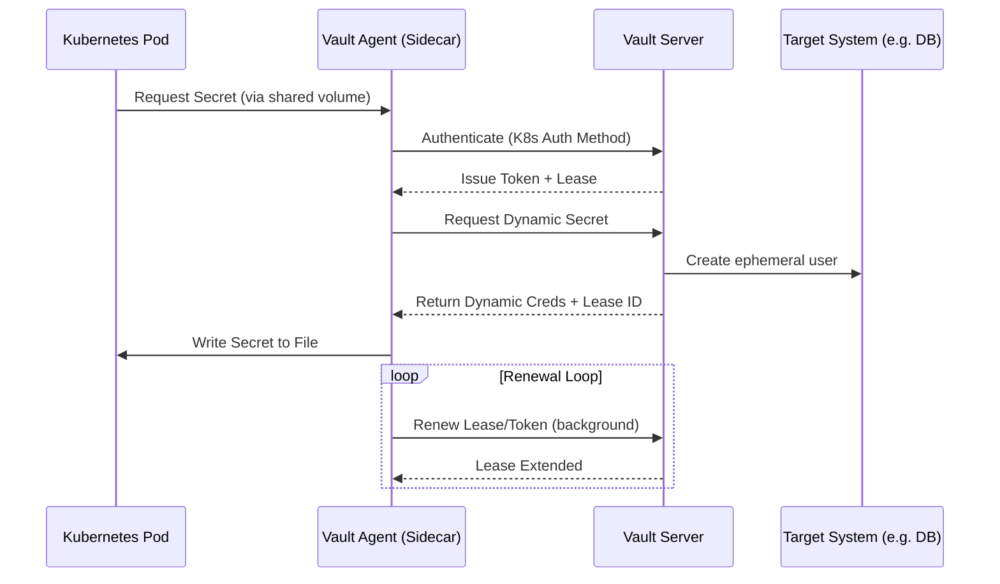

# Vault Leases in Kubernetes

In a Kubernetes environment, managing Vault leases and token lifecycles manually can be complex. HashiCorp provides tools like the **Vault Agent** and **Vault CSI Provider** to automate these processes.

## The Vault Agent Flow

The most common way to handle leases in K8s is using the Vault Agent Sidecar Injector.

## Key Components

### 1. K8s Auth Method
The Vault Agent uses the Pod's local **ServiceAccount Token** to authenticate with Vault. Vault verifies this token with the Kubernetes API server and returns a Vault Token with associated policies.

### 2. Sidecar Injection
Through annotations, Vault can automatically inject an agent sidecar into your Pod. This agent handles:
- **Authentication**: Managing the Vault token lifecycle.
- **Lease Management**: Automatically renewing leases for dynamic secrets.
- **Template Rendering**: Writing secrets to a shared memory volume (`/vault/secrets/`).

### 3. Transparent Renewal
Your application code doesn't need to know how to talk to Vault. It simply reads a file (e.g., `application.properties`) from a disk. The Vault Agent ensures that:
- If a secret is renewable, it is extended.
- If a secret expires or is revoked, it attempts to fetch a new one and updates the file.

## Why this matters in K8s?

- **Ephemeral Infrastructure**: Pods are created and destroyed frequently. Leases allow Vault to clean up credentials automatically when a Pod is deleted.
- **Security**: No long-lived credentials stored in K8s Secrets or environment variables.
- **Simplicity**: Developers focus on their logic, while the sidecar handles the complex security handshakes and lifecycle management.

## References
- [Vault Agent Sidecar Injector](https://developer.hashicorp.com/vault/docs/platform/k8s/injector)
- [Vault Kubernetes Auth Method](https://developer.hashicorp.com/vault/docs/auth/kubernetes)
