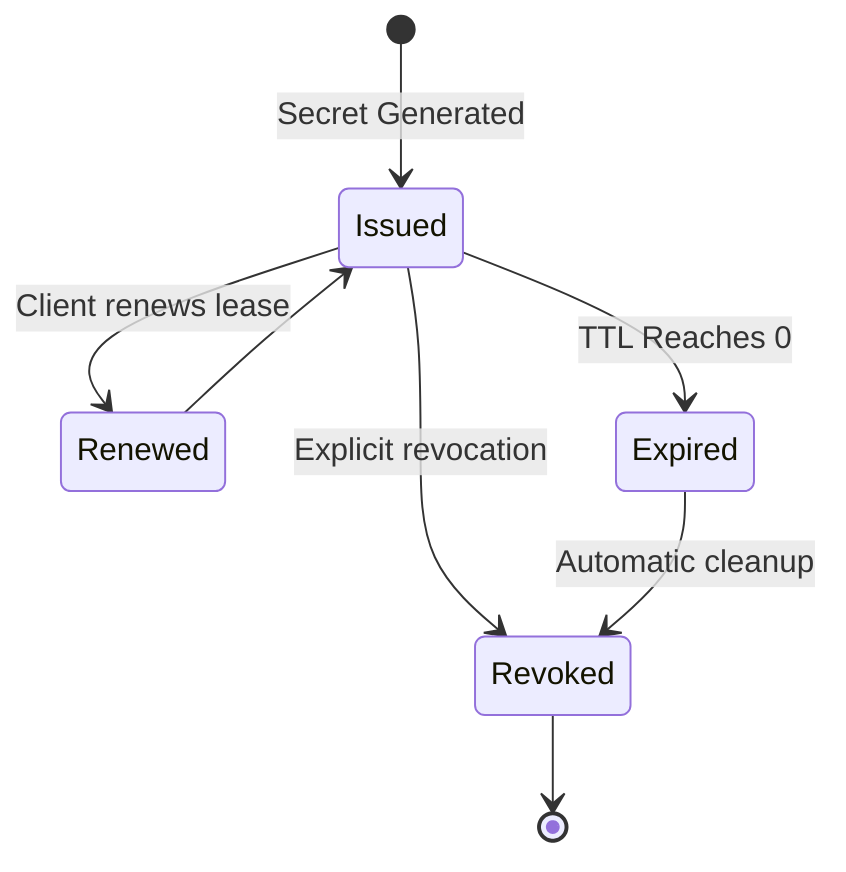

# Vault Leases

In HashiCorp Vault, a **Lease** is a metadata object associated with dynamic secrets and service tokens. It provides a way for Vault to track and manage the lifecycle of sensitive data.

## Why Leases?

Leases are fundamental to Vault's security model, especially for **Dynamic Secrets**. They ensure that:
1.  Secrets have a limited lifetime.
2.  Secrets can be revoked easily.
3.  Audit trails are maintained for every credential issued.

## Key Concepts

-   **Lease ID**: A unique identifier returned when a secret is generated (e.g., `database/creds/readonly/27e17b12-9843-11e7-8cfb-5404a614420e`).
-   **TTL (Time-To-Live)**: The duration for which the lease is valid.
-   **Max TTL**: The absolute maximum duration a lease can be extended (configurable globally or per engine).
-   **Renewable**: Many leases can be renewed. If a secret is still needed, the client can ask Vault to extend the TTL.

## Lease Lifecycle



### 1. Creation
When an application requests a dynamic secret (e.g., a database user), Vault generates the credential on the target system and creates a lease in its internal storage.

### 2. Renewal
If the application is still running and needs the secret, it should renew the lease. 
```bash
# Example of renewing a lease via CLI
vault lease renew <lease_id>
```

### 3. Revocation
When the lease expires or is explicitly revoked, Vault automatically connects to the target system and deletes the credential (e.g., `DROP USER ...`).

## Best Practices

-   **Don't Hardcode Leases**: Applications should be aware of the lease ID and handle renewal or re-authentication.
-   **Short TTLs**: Use the shortest possible TTL for your use case to minimize exposure.
-   **Monitor Expiration**: Use Vault Agent or built-in application logic to handle lease management transparently.

## References
- [Vault Lease Documentation](https://developer.hashicorp.com/vault/docs/concepts/lease)
