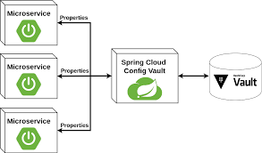

# Step 1: Spring load configuration from Vault (Static Secrets)

In this step, we configure Vault to work with our application. This includes:

1.  Enabling the **AppRole** authentication method.
2.  Creating a **Policy** that allows reading database secrets.
3.  Configuring the **Database Secret Engine** (Postgres).
4.  Creating a **Role** that maps the policy to the application.
5.  Configuring the **Spring Boot** application to use Vault:
    - Use the AppRole authentication method.
    - Use the static secrets (RoleID and SecretID) to login to Vault.
    - Use the database secret engine to get the database credentials (static secrets).


## How it works

To login to Vault using AppRole authentication method, we need to create a role and provide the RoleID and SecretID to the application. In this step, we will use static secrets (RoleID and SecretID) to login to Vault. 

In the following schema, the Vault admin can create the role and policy, and the application can use the **RoleID** and **SecretID** to login to Vault. Vault returns a token to the application, and the application can use the token to get the database credentials.


After getting the **token**, the application can send the token to the Vault to get the database credentials from the **static secret engine**.




### Option 1: Many secrets in the same path (simple)

In this case, we will have **only one path** to read the secrets from Vault. 

**Example :** if you have this path `secrets/data/AP0001/database`, you can use the following config :

```yaml
spring:
  cloud:
    vault:
      kv:
        backend: secrets
        application-name: AP0001/database
        default-context: ""
 ````

 You can use it simply like this : 

```yaml
spring:
  datasource:
    url: jdbc:postgresql://localhost:5432/test?:5432/${POSTGRES_DB:test}
    username: ${username}
    password: ${password}
```

if you have this database config in vault : 

```json
{
    "username": "user",
    "password": "password"
}
```

to see the secrets loaded by vault, you can use the following URL (only for dev environment): 

```bash
http://localhost:8080/actuator/env
# OR
http://localhost:8080/actuator/configprops

# Additional configuration to see the secrets loaded by vault
# Actuator endpoints
http://localhost:8080/actuator
# Actuator health 
http://localhost:8080/actuator/health
```

To activate the debug mode, you can add the following property : 

```yaml
# Activate log TRACE
logging:
  level:
    org.springframework.web.client: TRACE
```

or the following environment variable (in K8S): 

```yaml
# Activate log TRACE in K8S environment
env:
  - name: LOGGING_LEVEL_ORG_SPRINGFRAMEWORK_WEB_CLIENT
    value: TRACE
```

### Option 2: One secret per path (multi-contexts)

If you have many secrets to loaded, you can use the `generic.application-name` to access to many path in the same time.

**Example :**  if you have 3 secrets like 

```bash
secrets/AP0001/database
secrets/AP0001/api
secrets/AP0001/mail
```

You can use the following example :


```yaml
spring:
  cloud:
    vault:
      kv:
        backend: secrets
        default-context: ""
      generic:
        enabled: true
        application-name:
          - AP0001/database
          - AP0001/api
          - AP0001/mail
 ````
### Option 3: Multi-env + multi-secrets (Best Practices)

If you have many secrets to loaded, you can use the `generic.application-name` to access to many path in the same time.

**Example :**  if you have 3 secrets like 

```bash
secrets/data/AP0001/dev/database
secrets/data/AP0001/dev/certs

secrets/data/AP0001/prod/database
secrets/data/AP0001/prod/certs
```

You can use the following example :


```yaml
spring:
  application:
    name: AP0001

  profiles:
    active: dev   # dev ou prod

  config:
    import: vault://

  cloud:
    vault:
      uri: http://localhost:8200
      authentication: APPROLE

      app-role:
        role-id: ${VAULT_ROLE_ID}
        secret-id: ${VAULT_SECRET_ID}

      kv:
        backend: secrets
        version: 2
        default-context: ""     # on désactive 'application'
        lifecycle:
          enabled: false        # secrets statiques

      generic:
        enabled: true
        application-name:
          - AP0001/${spring.profiles.active}/database
          - AP0001/${spring.profiles.active}/api
 ````


### NOTES : 

1. `bootstrap.yml` is no longer used in Spring Boot 3, because it is deprecated, we use `application.yml` instead. 
2. Only in Spring 2, you can use the `bootstrap.yml` file. 
- `bootstrap.yml` was loaded before `application.yml`
- Used for Spring Cloud configuration (Vault, Config Server, etc.)
3. Spring Cloud Vault load the from KV from the path `<backend>/data/<context>` : 
```php-template
<backend>/<context>
```
4. In Spring Cloud Vault, the <context> is: The logical name of the Vault secret that Spring is instructed to load. Spring determines contexts from (in this order):
  - the `default-context` → defaults to `application.yml` or `application.properties`
  - the `application-name`: 
  - the generic application name: `generic.application-name` or `SPRING_CLOUD_VAULT_GENERIC_APPLICATION_NAME=billing-service` or `--spring.cloud.vault.generic.application-name=billing-service`
  - the application name (fallback) : `spring.application.name` or `SPRING_APPLICATION_NAME=billing-service` or `--spring.application.name=billing-service`
5. The `default-context: ""` helps avoid unexpected access to `application` path in Vault.

6. The Spring Cloud Vault load the secrets from the path `<backend>/data/<context>`, and by défault we have the following paths to load the secrets : 
```shell 
/secret/{application}/{profile}
/secret/{application}
/secret/{default-context}/{profile}
/secret/{default-context}
```

for more details : [Spring Cloud Vault - Config & REST endpoint](https://cloud.spring.io/spring-cloud-vault/reference/html/#vault.config.backends.kv.versioned)

### Example for Spring 2: 

Exemple of config in `bootstrap.yml` (in Spring 2 is **Mondatory**):

```yaml
spring:
  application:
    name: AP0001

  cloud:
    vault:
      uri: http://localhost:8200
      authentication: APPROLE

      app-role:
        role-id: ${VAULT_ROLE_ID}
        secret-id: ${VAULT_SECRET_ID}

      kv:
        enabled: true
        backend: secrets
        version: 2
        application-name: AP0001/dev/database
        default-context: ""
```
Exemple of config in `application.yml`:

```yaml
spring:
  datasource:
    url: jdbc:postgresql://localhost:5432/test
    username: ${username}
    password: ${password}

  jpa:
    hibernate:
      ddl-auto: update
```
### REX – Spring Cloud Vault path resolution

#### Context

We were using Spring Cloud Vault (KV v2) with secrets organized under nested paths, for example:
```bash
secrets/data/ap9833/application
```
The expectation was that Spring would automatically load this secret.

#### Issue
Spring Cloud Vault did **not load the secret**, resulting in **missing properties** at startup.

No error occurred, but the secret was simply ignored.

#### Root Cause

Spring Cloud Vault does not recurse into sub-paths.

By default, it only loads secrets using the pattern:

```php-template
<backend>/data/<context>
```

It **will never automatically read**:

```php-template
<backend>/data/<context>/<sub-path>
```
So this path:

```php-template
<backend>/data/<context>/<sub-path>
```

is **not loaded** unless explicitly declared as a context.

#### Solution

The sub-path must be explicitly configured as a Vault context in Spring.

Example: 
```yaml
spring:
  cloud:
    vault:
      kv:
        backend: secrets
        application-name: ap9833/application
        default-context: ""
```

This forces Spring to read:

```shell
secrets/data/ap9833/application
```


## Infrastructure as Code (IaC) with Terraform

We use **Terraform** to apply this configuration automatically. Terraform spins up as a Docker container, talks to Vault, applies the `.tf` files, and then exits.

Terraform will output the role_id and secret_id that we need to use in our application. We will use these values in the next step.

We will use the following commands to apply the configuration and extract the role_id and secret_id if you need to do it manually:

```bash
# Terraform extract role_id and secret_id from terraform output
terraform output -raw role_id
terraform output -raw secret_id
```

For more information, see the [IaC Terraform Vault](./terraform/README.md).

## Run it

Run the following command to start everything:

```bash
# Run application & tests
./run.sh 
# Or run only the application
docker-compose -f ./docker-compose.yml up -d
```

If you need to rebuild the Spring app (e.g., after a code change), use:

```bash
docker-compose up -d --build --force-recreate
```

## Check it

You can verify that the containers are running:

```bash
docker ps
```

You should see `spring-app`, `postgres`, and `vault` containers up and running.

After running, you can test the application using this command 

```bash
# Run only the application test
./test.sh
```

This script waits until the Terraform container successfully exits.

## Access pgadmin: 

You can access pgadmin from your browser using the following credentials:

- **Email**: [PGADMIN_DEFAULT_EMAIL]
- **Password**: [PGADMIN_DEFAULT_PASSWORD]

and access pgadmin using this URL : 

[http://localhost:5050/browser/](http://localhost:5050/browser/)

## Cleanup

Do the following commands:

```bash
$ docker-compose down
$ rm terraform/terraform.tfstate
```

## Next Step

Once configured, we need to get the credentials (RoleID and SecretID) to login. Go to [Step 2](../step2/README.md).
