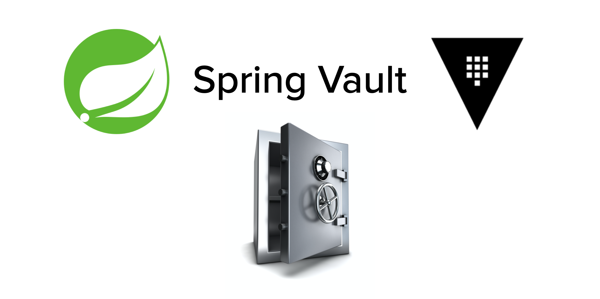
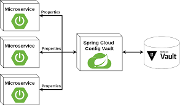

# Step 1: Spring load configuration from Vault (Static Secrets)

## Table of Contents

- [Overview](#overview)
- [Installation](#installation)
    - [Spring Boot 3.x vs 2.x Setups](#example-using-spring-boot-3x-spring-cloud-2023x)
    - [Main differences between Spring B. 2 and Spring B. 3](#main-differences-between-spring-boot-2-and-3-for-vault)
    - [Spring Boot vs Spring Cloud Starters](#spring-boot-starter-vault-config-vs-spring-cloud-starter-vault-config)
- [Login to Vault: How it works?](#login-to-vault-how-it-works-in-spring-cloud-vault-)
    - [1. Token Authentication](#1-login-with-token-authentication-method)
    - [2. AppRole Authentication](#2-login-with-approle-authentication-method)
    - [3. Kubernetes Authentication](#3-login-with-kubernetes-authentication-method)
- [Step-by-Step Process Breakdown](#step-by-step-breakdown-of-the-static-secret-retrieval-process)
- [Implementation in Spring Boot 3](#implementation-in-spring-boot-3-)
    - [Option 1: Single Path (Simple)](#option-1-many-secrets-in-the-same-path-simple)
    - [Option 2: Multi-Contexts](#option-2-one-secret-per-path-multi-contexts)
    - [Option 3: Multi-env (Best Practices)](#option-3-multi-env--multi-secrets-best-practices)
- [Implementation in Spring Boot 2](#implementation-in-spring-boot-2-)
- [Path Resolution (REX)](#rex--spring-cloud-vault-path-resolution)
- [Infrastructure as Code (IaC) with Terraform](#infrastructure-as-code-iac-with-terraform)
- [Running the Demo](#run-it)
- [Verification and Checks](#check-it)
- [Cleanup and Next Steps](#cleanup)

## Overview

In this step, we configure Vault to work with our application. This includes:

1.  Enabling the **AppRole** authentication method.
2.  Creating a **Policy** that allows reading database secrets.
3.  Configuring the **KV Secret Engine** (Static).
4.  Creating a **Role** that maps the policy to the application.
5.  Configuring the **Spring Boot** application to use Vault:
    - Use the AppRole authentication method.
    - Use the static secrets (RoleID and SecretID) to login to Vault.
    - Use the KV secret engine to get the database credentials (static secrets).



## Installation 

The dependencies for **Spring Cloud Vault** depend on the version of **Spring Boot** you are using, because each Spring Boot generation is compatible with a specific **Spring Cloud** release.

Below are the correct setups for **Spring Boot 3.x** and **Spring Boot 2.x**.

### Example using **Spring Boot 3.x (Spring Cloud 2023.x)**: 

Spring Boot 3.x uses Spring Cloud 2023.x.

```xml
  <!--  Properties -->
  <properties>
     <spring-cloud.version>2023.0.2</spring-cloud.version>
  </properties>

  <!--  Dependencies -->
	<dependencies>
    <!-- Spring Cloud Vault Dependencies -->
		<dependency>
			<groupId>org.springframework.cloud</groupId>
			<artifactId>spring-cloud-starter-vault-config</artifactId>
		</dependency>
	</dependencies>

  <!-- Dependency Management to import the Spring Cloud dependencies -->
  <dependencyManagement>
		<dependencies>
			<dependency>
				<groupId>org.springframework.cloud</groupId>
				<artifactId>spring-cloud-dependencies</artifactId>
				<version>${spring-cloud.version}</version>
				<type>pom</type>
				<scope>import</scope>
			</dependency>
		</dependencies>
	</dependencyManagement>
```

### Example using **Spring Boot 2.x (Spring Cloud 2021.x)**: 

Spring Boot 2.x uses Spring Cloud 2021.x.

```xml
  <!--  Properties -->
  <properties>
     <spring-cloud.version>2021.0.8</spring-cloud.version>
  </properties>

  <!--  Dependencies -->
	<dependencies>
    <!-- Spring Cloud Vault Dependencies -->
		<dependency>
			<groupId>org.springframework.cloud</groupId>
			<artifactId>spring-cloud-starter-vault-config</artifactId>
		</dependency>
	</dependencies>

  <!-- Dependency Management to import the Spring Cloud dependencies -->
  <dependencyManagement>
		<dependencies>
			<dependency>
				<groupId>org.springframework.cloud</groupId>
				<artifactId>spring-cloud-dependencies</artifactId>
				<version>${spring-cloud.version}</version>
				<type>pom</type>
				<scope>import</scope>
			</dependency>
		</dependencies>
	</dependencyManagement>
```

### Main differences between Spring Boot 2 and 3 for Vault

| Feature                   | Spring Boot 2   | Spring Boot 3          |
| ------------------------- | --------------- | ---------------------- |
| Config loading            | `bootstrap.yml` | `spring.config.import` |
| Spring Cloud version      | 2021.x          | 2023.x                 |
| Java version              | Java 8–11       | Java 17+               |
| Recommended secret engine | KV v2           | KV v2                  |

#### NOTE : 

With **Spring Boot 3.x**, the `bootstrap.yml` file is **no longer loaded automatically** as it was in **Spring Boot 2.x**. However, you can still use it by adding the **Spring Cloud Bootstrap starter**. This is often needed for tools like **Spring Cloud Vault** or **Spring Cloud Config**.

```xml 
<dependency>
    <groupId>org.springframework.cloud</groupId>
    <artifactId>spring-cloud-starter-bootstrap</artifactId>
</dependency>
```

#### **spring-boot-starter-vault-config** vs **spring-cloud-starter-vault-config**

The difference between **spring-boot-starter-vault-config** and **spring-cloud-starter-vault-config** mainly comes from which ecosystem manages the integration with **HashiCorp Vault** and how configuration is loaded in **Spring Boot** applications.

| Feature | **spring-boot-starter-vault-config** | **spring-cloud-starter-vault-config** |
| --- | --- | --- |
| **Ecosystem** | Spring Boot Native | Spring Cloud |
| **Configuration Loading** | `spring.config.import` in `application.yml` | `bootstrap.yml` (with `spring-cloud-starter-bootstrap`) |
| **Dependencies** | `spring-boot-starter-vault-config` | `spring-cloud-starter-vault-config` |
| **Usage** | Standalone Spring Boot applications | Spring Cloud applications (with Spring Cloud Config, etc.) |


#### 1️⃣ spring-cloud-starter-vault-config (Recommended)

This starter belongs to Spring Cloud Vault.

It provides full integration with Spring Cloud configuration mechanisms.

**Features:** 

* Integration with Spring Cloud Config ecosystem
* Support for spring.config.import=vault://
* Multiple secret backends (KV, database, AWS, etc.)
* Dynamic secrets and rotation
* Authentication methods:
  - Token
  - Kubernetes
  - AppRole
  - AWS IAM
  - TLS certificates
* Property sources automatically loaded at startup

#### Maven dependency

```xml 
<dependency>
    <groupId>org.springframework.cloud</groupId>
    <artifactId>spring-cloud-starter-bootstrap</artifactId>
</dependency>
```
#### Typical configuration : 

```yml 
spring:
  config:
    import: vault://
  cloud:
    vault:
      uri: http://localhost:8200
      authentication: TOKEN
      token: ${VAULT_TOKEN}
```

#### Use case : 

- Microservices
- Kubernetes deployments
- Cloud-native applications
- DevSecOps architectures

This is the most commonly used dependency in production.

#### 2️⃣ spring-boot-starter-vault-config

This starter was historically used when Vault integration was **more Boot-centric**, but today it is **rarely used directly**.

It typically comes from Spring Vault integration libraries.

**Features**

* Basic Vault integration
* Less integration with Spring Cloud configuration
* Limited advanced configuration features compared to Spring Cloud Vault

#### Maven dependency

```xml 
<dependency>
    <groupId>org.springframework.boot</groupId>
    <artifactId>spring-boot-starter-vault-config</artifactId>
</dependency>
<dependency>
    <groupId>org.springframework.vault</groupId>
    <artifactId>spring-vault-core</artifactId>
</dependency>
```

#### Typical configuration : 

```yml 
spring:
  cloud:
    vault:
      uri: http://127.0.0.1:8200
      token: <your-root-token>
      scheme: http
      kv:
        enabled: true
        backend: secret
        default-context: application
```

#### Use case : 

It may appear in older setups or direct **Spring Vault** client usage.

You can see [this medium article](https://medium.com/@ShantKhayalian/setting-up-vault-in-spring-a-comprehensive-guide-bbdbb5ce82e6) for more information.

## Login to Vault: How it works in Spring Cloud Vault ?

In this section, we will explain how to login to Vault using different authentication methods using Spring Cloud Vault.

Available authentication methods:

- Token
- AppRole
- Kubernetes



### 1. Login with Token authentication method

#### Use cases

* Local development environments
* CI/CD pipelines
* Testing environments
* Simple integrations or scripts

#### Advantages

* Very easy to configure
* Quick setup for development and testing
* No additional infrastructure configuration required
* Direct authentication with Vault

#### Limitations

* Tokens must be stored securely
* Token leakage can expose secrets
* Manual rotation may be required
* Not recommended for production workload

#### Example : 

```yaml
spring:
  # Spring Boot App name
  application:
    name: AP0001
  # Spring Config
  config:
    import: vault://
  # Spring Cloud Vault
  cloud:
    vault:
      uri:  ${VAULT_ADDR:http://localhost:8200}
      # Spring Cloud Vault authentication method (TOKEN authentication)
      authentication: TOKEN
      token: ${VAULT_TOKEN}
      kv:
        # Active l’utilisation du moteur KV (Key-Value)
        enabled: true
....        
```

### 2. Login with AppRole authentication method

To login to Vault using AppRole authentication method, we need to create a role and provide the RoleID and SecretID to the application. In this step, we will use static secrets (RoleID and SecretID) to login to Vault. 

In the following schema, the Vault admin can create the role and policy, and the application can use the **RoleID** and **SecretID** to login to Vault. Vault returns a token to the application, and the application can use the token to get the database credentials.


After getting the **token**, the application can send the token to the Vault to get the database credentials from the **static secret engine**.

#### Use cases

* Machine-to-machine authentication
* Backend services running outside Kubernetes
* CI/CD pipelines
* VM-based workloads

#### Advantages

* Strong authentication for applications
* Supports secret rotation
* Allows separation between Role ID and Secret ID
* More secure than static tokens
* Works well for automated systems and service accounts

#### Limitations

* Requires management of Role IDs and Secret IDs
* Slightly more complex setup than token authentication

#### Example : 

```yaml
spring:
  # Spring Boot App name
  application:
    name: AP0001
  # Spring Config
  config:
    import: vault://
  # Spring Cloud Vault
  cloud:
    vault:
      uri:  ${VAULT_ADDR:http://localhost:8200}
      # Spring Cloud Vault authentication method (APPROLE authentication)
      authentication: APPROLE
      app-role:
        role-id: ${VAULT_ROLE_ID}
        secret-id: ${VAULT_SECRET_ID}
      kv:
        # Active l’utilisation du moteur KV (Key-Value)
        enabled: true
....        
```

### 3. Login with Kubernetes authentication method

#### Use cases

* Applications running inside Kubernetes clusters
* Microservices architectures
* Cloud-native deployments
* Platforms like EKS, AKS, or GKE

#### Advantages

* No static credentials required
* Uses Kubernetes ServiceAccount identity
* Automatic authentication for pods
* Highly secure and scalable
* Ideal for dynamic and containerized environments
* Integrates naturally with Kubernetes RBAC and service accounts

#### Limitations

* Requires Kubernetes configuration in Vault
* Slightly more complex initial setup

#### Example : 

```yaml
spring:
  # Spring Boot App name
  application:
    name: AP0001
  # Spring Config
  config:
    import: vault://
  # Spring Cloud Vault
  cloud:
    vault:
      uri:  ${VAULT_ADDR:http://localhost:8200}
      # Spring Cloud Vault authentication method (KUBERNETES authentication)
      authentication: KUBERNETES
      kubernetes:
        role: ap0001-role
        service-account-token-file: /var/run/secrets/kubernetes.io/serviceaccount/token
      kv:
        # Active l’utilisation du moteur KV (Key-Value)
        enabled: true
....        
```

---
### Step-by-Step Breakdown of the Static Secret Retrieval Process

1. **Enable AppRole Authentication Method**
    - Configure the **AppRole** authentication method in Vault.
    - RoleID and SecretID are used by the application to authenticate.

2. **Create a Policy for Access**
    - Define a **Vault Policy** that provides read access to the required secrets (e.g., database credentials).

3. **Set Up the KV Secrets Engine**
    - Enable the **KV Secret Engine** in Vault (v2 recommended).
    - Store the static database credentials.

4. **Define a Role for Application Mapping**
    - Link the previously created policy to a specific role.
    - The application will use this role.

5. **Configure Spring Boot Application to Connect to Vault**
    - Set `spring.cloud.vault` properties in `application.yml`.
    - Use the `AppRole` authentication method to provide RoleID and SecretID.
    - Configure paths (`kv.backend`, `application-name`, and additional context).

6. **Authenticate and Retrieve Secrets**
    - The Spring application authenticates using RoleID and SecretID.
    - Retrieve the database credentials or other secrets based on the defined configuration.
## Implementation in Spring Boot 3 :

### Available Options:

1. **Option 1: Many secrets in the same path (simple)**  
   In this option, a single path is used to access secrets in Vault.

2. **Option 2: One secret per path (multi-contexts)**  
   This option allows managing multiple secrets by accessing different paths at the same time.

3. **Option 3: Multi-env + multi-secrets (Best Practices)**  
   This option is ideal for managing secrets across multiple environments (e.g., dev, prod) and multiple paths.

We have a total of **3 options** available for loading secrets from Vault.
### Option 1: Many secrets in the same path (simple)

In this case, we will have **only one path** to read the secrets from Vault. 

**Example :** if you have this path `secrets/data/AP0001/database`, you can use the following config :

```yaml
spring:
  # Spring Boot App name
  application:
    name: AP0001
  # Spring Config
  config:
    import: vault://
  # Spring Cloud Vault
  cloud:
    vault:
      kv:
        backend: secrets
        application-name: AP0001/database
        default-context: ""
 ```

 You can use it simply like this : 

```yaml
spring:
  datasource:
    url: jdbc:postgresql://localhost:5432/test?:5432/${POSTGRES_DB:test}
    username: ${username}
    password: ${password}
```

if you have this database config in vault : 

```json
{
    "username": "user",
    "password": "password"
}
```

to see the secrets loaded by vault, you can use the following URL (only for dev environment): 

```bash
# To see the env variables (injected by Spring Cloud Vault)
http://localhost:8080/actuator/env
# OR (NOTE: values are masked as ***)
http://localhost:8080/actuator/configprops

# Additional configuration to see the secrets loaded by vault
# Actuator endpoints
http://localhost:8080/actuator
# Actuator health 
http://localhost:8080/actuator/health
```

To activate the debug mode, you can add the following property : 

```yaml
# Activate log TRACE
logging:
  level:
    org.springframework.web.client: TRACE
```

or the following environment variable (in K8S): 

```yaml
# Activate log TRACE in K8S environment
env:
  - name: LOGGING_LEVEL_ORG_SPRINGFRAMEWORK_WEB_CLIENT
    value: TRACE
```

#### Advantages:

* cleaner structure
* supports environments and profiles
* easier secret reuse.

#### Alternative: Using profiles for sub-contexts

You can load multiple contexts with profiles.

```yaml
# Option 1: if we have secrets/AP0001-database
spring:
  application:
    name: AP0001
  config:
    import: vault://
  cloud:
    vault:
      kv:
        backend: secrets
        application-name: AP0001
        profiles: database
# Option 2: if we have secrets/AP0001/database
spring:
  application:
    name: AP0001
  config:
    import: vault://
  profiles:
    active: database
  cloud:
    vault:
      kv:
        backend: secrets
        application-name: AP0001
        profile-separator: /
```

In this case, we need to create the path in Vault like : 

```shell
# Option 1: if we have secrets/AP0001-database
secrets/AP0001-database
# Option 2: if we have secrets/AP0001/database
secrets/AP0001/database
```

In this case the default profile separator is `-`, so if you have `/` in the vault path you need to define the propertie `profile-separator: /` in your `application.yml`.

##### Advantages:

* works well for environment-specific configs
* follows Spring profile conventions.

#### Alternative: Multiple Vault imports (explicit paths)

If you want precise control, you can import specific paths.

```yaml
spring:
  application:
    name: AP0001
  config:
    import:
      - vault://secrets/AP0001/database
```

##### Advantages:

* very explicit configuration
* useful when different modules load different secrets.

### Option 2: One secret per path (multi-contexts)

If you have many secrets to loaded, you can use the `generic.application-name` to access to many path in the same time.

**Example :**  if you have 3 secrets like 

```bash
secrets/AP0001/database
secrets/AP0001/api
secrets/AP0001/mail
```

You can use the following example :


```yaml
# Option 1: Multiple contexts KV 
spring:
  # Spring Boot App name
  application:
    name: AP0001
  # Spring Config
  config:
    import: vault://
  # Spring Cloud Vault
  cloud:
    vault:
      kv:
        backend: secrets
        default-context: ""
      generic:
        enabled: true
        application-name:
          - AP0001/database
          - AP0001/api
          - AP0001/mail
# Option 2: using profiles
spring:
  application:
    name: AP0001
  config:
    import: vault://
  profiles:
    active: database,api,mail
  cloud:
    vault:
      kv:
        backend: secrets
        application-name: AP0001
        profile-separator: /
# Option 3: Clean enterprise structure (recommended)
spring:
  application:
    name: AP0001
  config:
    import:
      - vault://secrets/AP0001/database
      - vault://secrets/AP0001/api
      - vault://secrets/AP0001/mail
 ```
### Option 3: Multi-env + multi-secrets (Best Practices)

If you have many secrets to loaded, you can use the `generic.application-name` to access to many path in the same time.

**Example :**  if you have 3 secrets like 

```bash
secrets/data/AP0001/dev/database
secrets/data/AP0001/dev/certs

secrets/data/AP0001/prod/database
secrets/data/AP0001/prod/certs
```

You can use the following example :


```yaml
# Option 1: Multiple KV context
spring:
  # Spring Boot App name
  application:
    name: AP0001
  # Spring Active Profile
  profiles:
    active: dev   # dev,int,qua,perf,pprd or prod
  # Spring Config
  config:
    import: vault://
  # Spring Cloud Vault
  cloud:
    vault:
      uri: http://localhost:8200
      authentication: APPROLE

      app-role:
        role-id: ${VAULT_ROLE_ID}
        secret-id: ${VAULT_SECRET_ID}

      kv:
        backend: secrets
        version: 2
        default-context: ""     # on désactive 'application'
        lifecycle:
          enabled: false        # secrets statiques

      generic:
        enabled: true
        application-name:
          - AP0001/${spring.profiles.active}/database
          - AP0001/${spring.profiles.active}/api

# Option 2: Clean enterprise structure (recommended)
spring:
  application:
    name: AP0001

  profiles:
    active: dev

  config:
    import:
      - vault://secrets/AP0001/${spring.profiles.active}/database
      - vault://secrets/AP0001/${spring.profiles.active}/api

  cloud:
    vault:
      uri: http://localhost:8200
      authentication: APPROLE

      app-role:
        role-id: ${VAULT_ROLE_ID}
        secret-id: ${VAULT_SECRET_ID}

      kv:
        backend: secrets
        version: 2
        lifecycle:
          enabled: false

 ```


### NOTES : 

1. `bootstrap.yml` is no longer used in Spring Boot 3, because it is deprecated, we use `application.yml` instead. 
2. Only in Spring 2, you can use the `bootstrap.yml` file. 
- `bootstrap.yml` was loaded before `application.yml`
- Used for Spring Cloud configuration (Vault, Config Server, etc.)
3. Spring Cloud Vault load the from KV from the path `<backend>/data/<context>` : 
```php-template
<backend>/<context>
```
4. In Spring Cloud Vault, the <context> is: The logical name of the Vault secret that Spring is instructed to load. Spring determines contexts from (in this order):
  - the `default-context` → defaults to `application.yml` or `application.properties`
  - the `application-name`: 
  - the generic application name: `generic.application-name` or `SPRING_CLOUD_VAULT_GENERIC_APPLICATION_NAME=billing-service` or `--spring.cloud.vault.generic.application-name=billing-service`
  - the application name (fallback) : `spring.application.name` or `SPRING_APPLICATION_NAME=billing-service` or `--spring.application.name=billing-service`
5. The `default-context: ""` helps avoid unexpected access to `application` path in Vault.

6. The Spring Cloud Vault load the secrets from the path `<backend>/data/<context>`, and by défault we have the following paths to load the secrets : 
```shell 
/secret/{application}/{profile}
/secret/{application}
/secret/{default-context}/{profile}
/secret/{default-context}
```

for more details : [Spring Cloud Vault - Config & REST endpoint](https://cloud.spring.io/spring-cloud-vault/reference/html/#vault.config.backends.kv.versioned)

7. To disable database connection 

* Disable Database versionning connection (flyway or liquibase):

```yml
spring:
  # Disable flyway
  flyway:
    enabled: false
  # Disable liquibase
  liquibase:
    enabled: false
```

Or using env variables : 

```yml
env: 
  - name: SPRING_FLYWAY_ENABLED
    value: "false"
  - name: SPRING_LIQUIBASE_ENABLED
    value: "false"
```

* Disable Postgres auto connexion :

```yml
spring:
  autoconfigure:
    exclude:
      - org.springframework.boot.autoconfigure.jdbc.DataSourceAutoConfiguration
      - org.springframework.boot.autoconfigure.orm.jpa.HibernateJpaAutoConfiguration
```

Or using env variables : 

```yml
env:
  - name: SPRING_AUTOCONFIGURE_EXCLUDE
    value: org.springframework.boot.autoconfigure.jdbc.DataSourceAutoConfiguration,org.springframework.boot.autoconfigure.orm.jpa.HibernateJpaAutoConfiguration
```

* Disable ElasticSearch auto connexion :


```yml
spring:
  autoconfigure:
    exclude:
      - org.springframework.boot.autoconfigure.elasticsearch.ElasticsearchClientAutoConfiguration
      - org.springframework.boot.autoconfigure.data.elasticsearch.ElasticsearchDataAutoConfiguration
```

Or using env variables : 

```yml
env:
  - name: SPRING_AUTOCONFIGURE_EXCLUDE
    value: org.springframework.boot.autoconfigure.elasticsearch.ElasticsearchClientAutoConfiguration,org.springframework.boot.autoconfigure.data.elasticsearch.ElasticsearchDataAutoConfiguration
```

* Disable MongoDB auto connexion :


```yml
spring:
  autoconfigure:
    exclude:
      - org.springframework.boot.autoconfigure.mongo.MongoAutoConfiguration
      - org.springframework.boot.autoconfigure.data.mongo.MongoDataAutoConfiguration
```

Or using env variables : 

```yml
env:
  - name: SPRING_AUTOCONFIGURE_EXCLUDE
    value: org.springframework.boot.autoconfigure.mongo.MongoAutoConfiguration,org.springframework.boot.autoconfigure.data.mongo.MongoDataAutoConfiguration
```

## Implementation in Spring Boot 2: 

Exemple of config in `bootstrap.yml` (in Spring 2 is **Mondatory**):

```yaml
spring:
  application:
    name: AP0001

  cloud:
    vault:
      uri: http://localhost:8200
      authentication: APPROLE

      app-role:
        role-id: ${VAULT_ROLE_ID}
        secret-id: ${VAULT_SECRET_ID}

      kv:
        enabled: true
        backend: secrets
        version: 2
        application-name: AP0001/dev/database
        default-context: ""
```
Exemple of config in `application.yml`:

```yaml
spring:
  datasource:
    url: jdbc:postgresql://localhost:5432/test
    username: ${username}
    password: ${password}

  jpa:
    hibernate:
      ddl-auto: update
```
### REX – Spring Cloud Vault path resolution

#### Context

We were using Spring Cloud Vault (KV v2) with secrets organized under nested paths, for example:
```bash
secrets/data/ap9833/application
```
The expectation was that Spring would automatically load this secret.

#### Issue
Spring Cloud Vault did **not load the secret**, resulting in **missing properties** at startup.

No error occurred, but the secret was simply ignored.

#### Root Cause

Spring Cloud Vault does not recurse into sub-paths.

By default, it only loads secrets using the pattern:

```php-template
<backend>/data/<context>
```

It **will never automatically read**:

```php-template
<backend>/data/<context>/<sub-path>
```
So this path:

```php-template
<backend>/data/<context>/<sub-path>
```

is **not loaded** unless explicitly declared as a context.

#### Solution

The sub-path must be explicitly configured as a Vault context in Spring.

Example: 
```yaml
spring:
  cloud:
    vault:
      kv:
        backend: secrets
        application-name: ap9833/application
        default-context: ""
```

This forces Spring to read:

```shell
secrets/data/ap9833/application
```


## Infrastructure as Code (IaC) with Terraform

We use **Terraform** to apply this configuration automatically. Terraform spins up as a Docker container, talks to Vault, applies the `.tf` files, and then exits.

Terraform will output the role_id and secret_id that we need to use in our application. We will use these values in the next step.

We will use the following commands to apply the configuration and extract the role_id and secret_id if you need to do it manually:

```bash
# Terraform extract role_id and secret_id from terraform output
terraform output -raw role_id
terraform output -raw secret_id
```

For more information, see the [IaC Terraform Vault](./terraform/README.md).

## Run it

Run the following command to start everything:

```bash
# Run application & tests
./run.sh 
# Or run only the application
docker-compose -f ./docker-compose.yml up -d
```

If you need to rebuild the Spring app (e.g., after a code change), use:

```bash
docker-compose up -d --build --force-recreate
```

## Check it

You can verify that the containers are running:

```bash
docker ps
```

You should see `spring-app`, `postgres`, and `vault` containers up and running.

After running, you can test the application using this command 

```bash
# Run only the application test
./test.sh
```

This script waits until the Terraform container successfully exits.

## Access pgadmin: 

You can access pgadmin from your browser using the following credentials:

- **Email**: [PGADMIN_DEFAULT_EMAIL]
- **Password**: [PGADMIN_DEFAULT_PASSWORD]

and access pgadmin using this URL : 

[http://localhost:5050/browser/](http://localhost:5050/browser/)

## Cleanup

Do the following commands:

```bash
$ docker-compose down
$ rm terraform/terraform.tfstate
```

## Next Step

Done with static secrets? Let's move to dynamic secrets (Secret as a Service)! Go to [Step 2](../step2/README.md).
